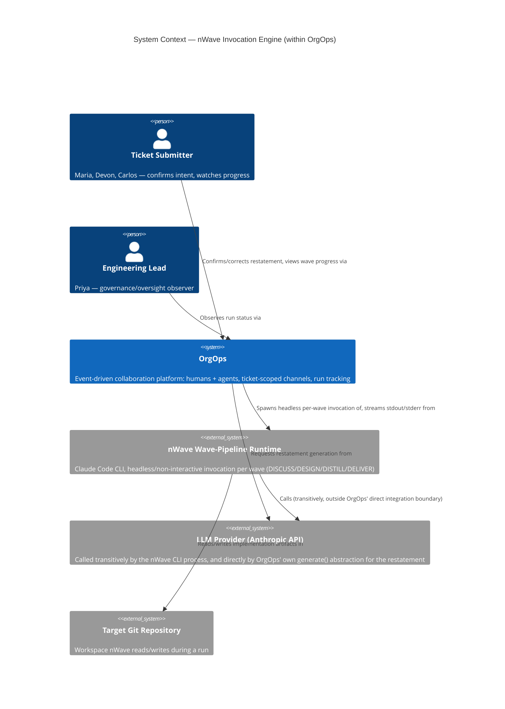
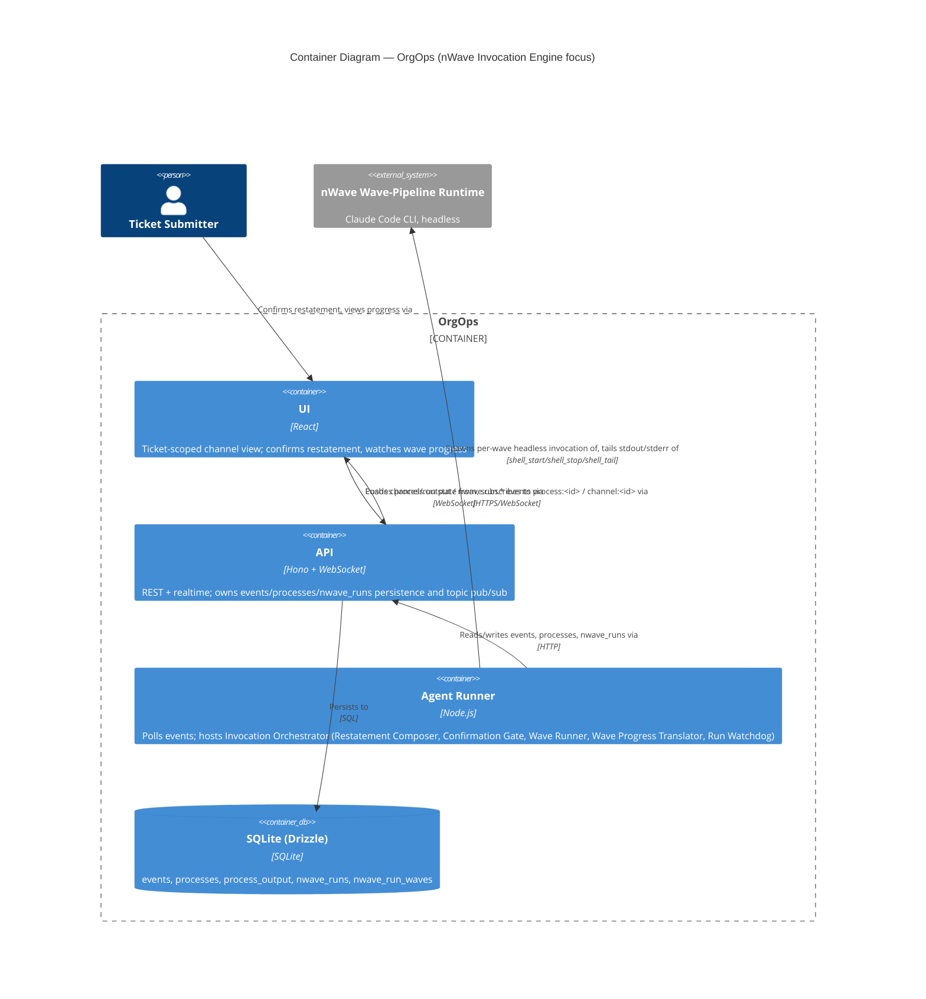
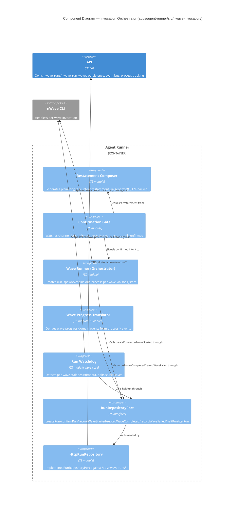
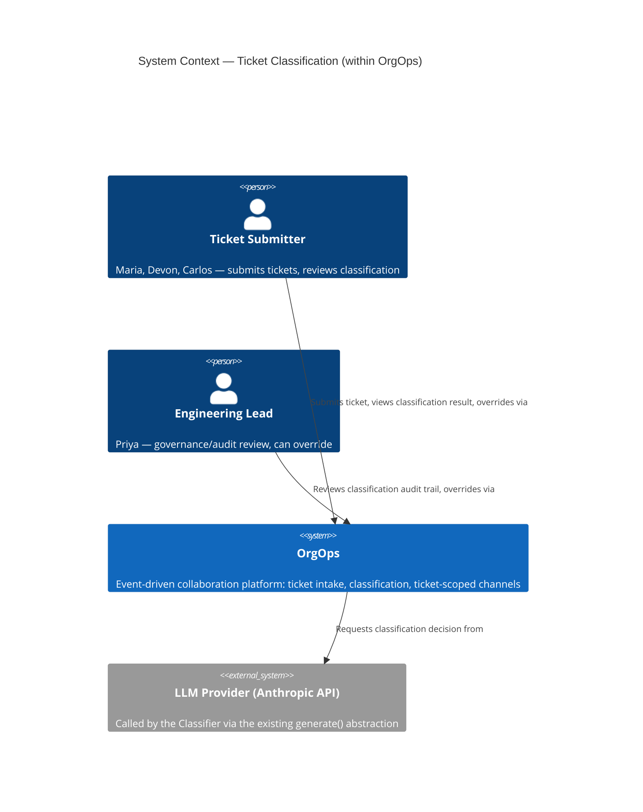
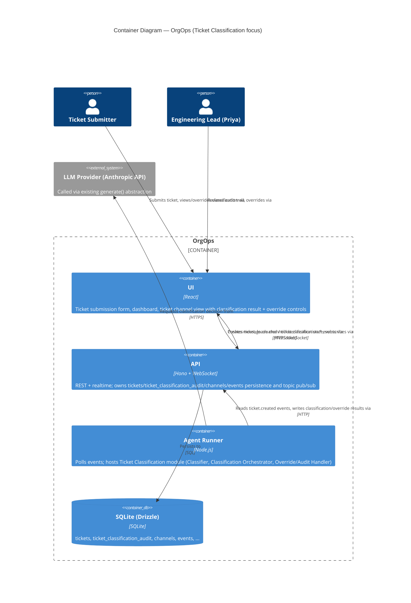
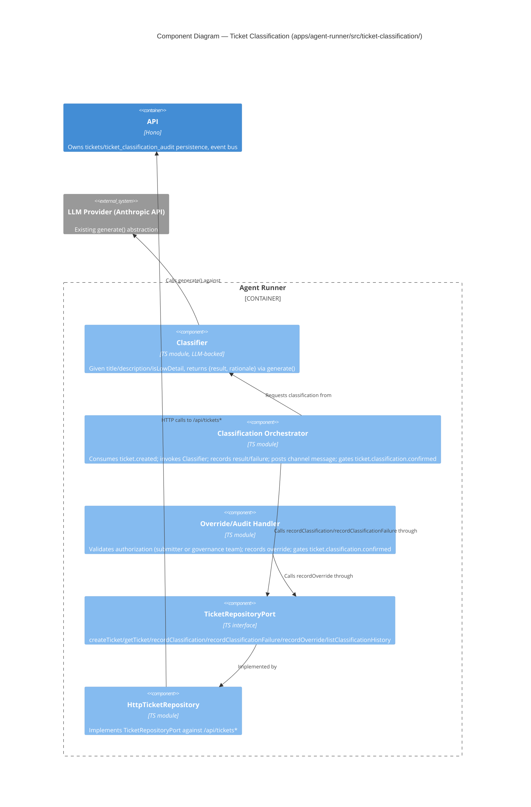
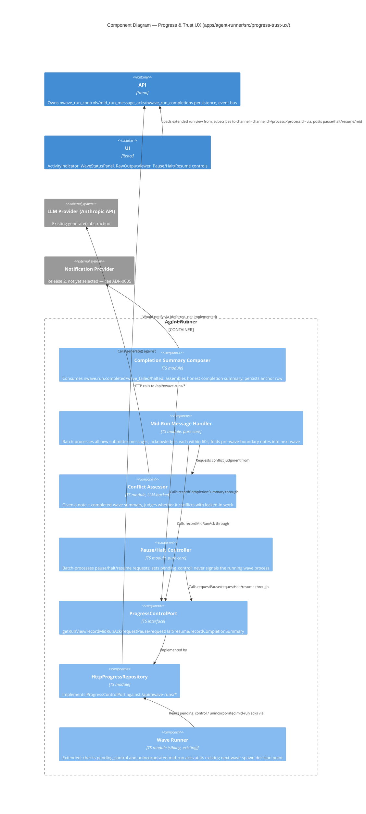
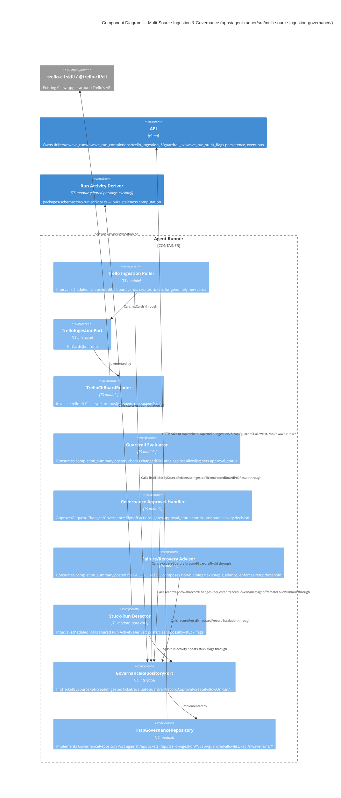

# OrgOps Architecture Brief

This is the first DESIGN-wave architecture document for OrgOps. It is authored by Morgan
(solution-architect) for the `nwave-invocation-engine` track. No prior `## System Architecture`
or `## Domain Model` sections exist yet (no Titan/Hera passes have run on this project) — this
document currently contains only Morgan's `## Application Architecture` section. Future
architects (platform/system/DDD) should append their own top-level sections rather than
rewriting this one.

## Scope of This Pass

Per explicit product-owner scope decision for this track: **application/component-level
design only.** The core question answered here is how OrgOps' existing `agent-runner`
harness/tool model is extended to trigger and stream a headless nWave wave-pipeline run for a
confirmed development ticket (US-04). `run_id`/`wave_status` are modeled as lightweight
entities/value objects as part of this application architecture, not as a separate DDD
bounded-context exercise.

**Headless nWave invocation feasibility is an accepted working assumption inherited from
DISCUSS, not an empirically validated fact.** The planned validation SPIKE was explicitly
skipped per user directive. This design accounts for the chosen mechanism's shape; it does not
prove the mechanism works. The first real implementation attempt is what proves it. See
`docs/feature/nwave-invocation-engine/discuss/wave-decisions.md` Decision 1 and this track's
`design/wave-decisions.md`.

## Application Architecture

### Quality Attribute Priorities

Ranked by evidence from DISCUSS (anxiety-dominant JTBD forces around trust/visibility — see
umbrella `jtbd-four-forces.md`) and this track's own constraints:

1. **Reliability / fault tolerance** — highest priority. US-04 AC5: "A failed trigger attempt
   is clearly communicated, never silently treated as 'in progress.'" The single worst outcome
   this design must prevent is a submitter believing work is happening when it is not.
2. **Testability** — the invocation mechanism is unvalidated; the design must let each piece
   (confirmation gating, run/wave state transitions, watchdog timeout logic) be unit-tested
   without spawning real processes, so correctness can be verified independently of the
   as-yet-unproven headless-nWave assumption.
3. **Maintainability** — small, active team; new code must follow existing conventions
   (factory functions over Maps, kebab-case modules, no shared-abstraction changes — see
   ADR-0001) so it is cheap to revise once the first real run exposes wrong assumptions.

Not prioritized in this pass: performance/scalability beyond the stated NFR (5 concurrent
runs, walking-skeleton scale), security beyond existing workspace/secrets boundaries (no new
threat surface introduced), portability (single-deployment monolith, no change).

### Constraints

- Small, single team (Conway's Law: no team-boundary conflict — one team owns `agent-runner`,
  `api`, and `db` packages; no reason to split components across service/deployment
  boundaries).
- Existing systems to integrate with, not replace: `agent-runner`'s harness/tool model, the
  in-process event bus + WebSocket topic pub/sub, SQLite via Drizzle, the existing
  `processes`/`process_output` tables and `/api/processes*` routes.
- No regulatory requirements evident.
- Operational maturity: vitest test suite, lint, CI release automation already in place
  (`docs/SPEC.md`) — new code should be held to the same bar (unit-testable, typed, linted).
- No ticket domain model exists yet in `packages/db/src/schema.ts` — `run_id`/`wave_status`
  are genuinely new, confirmed by grep (no `ticket` table exists).

### Development Paradigm — Recommended, Pending Human Confirmation

**No root `CLAUDE.md` paradigm declaration exists in this repository.** Based on reading
`apps/agent-runner/src/intent-watchdog.ts`, `channel-loop.ts`, and `event-routing.ts`, the
existing convention is **functional-leaning TypeScript**: no classes; small pure functions
operating on explicitly passed-in state (`ingestIntentEvents(input: {...})`,
`collectDueIntentTimeouts(input: {...})` take a `Map` as an explicit parameter and return new
derived values rather than mutating hidden instance state); factory functions that return
closures (`createChannelLoopManager`, `createWrapExecute`) instead of classes with methods;
composition of small named functions (`shouldHandleEventForAgent`, `isBookkeepingEvent`,
`isAgentActionEvent`) rather than large conditional blocks.

**Recommendation: continue functional-leaning TypeScript for the new `nwave-invocation`
module** — pure functions for state-transition logic (run/wave status transitions, watchdog
due-timeout detection, mirroring `intent-watchdog.ts`'s `ingest*`/`collectDue*` pattern
exactly), with a thin factory-function adapter layer for I/O (HTTP calls to the new
`/api/nwave-runs*` routes), consistent with how `tools/shell.ts` and `wrapper-harness/
command.ts` already separate pure parsing/normalization functions from the imperative
`spawn`/`fetch` calls.

**This is a recommendation, not a final decision.** No root `CLAUDE.md` exists to declare a
project-wide paradigm, and writing one is a shared-config change requiring explicit human
sign-off this session cannot obtain. This recommendation is restated and flagged
"pending human confirmation" in `docs/feature/nwave-invocation-engine/design/wave-decisions.md`
rather than committed to project config here.

### Architecture Style

**Modular monolith with dependency inversion (ports-and-adapters), applied locally to the new
module.** No change to OrgOps' overall single-process deployment shape. This follows the
default per `nw-architecture-patterns`/`nw-architectural-styles-tradeoffs`: small team,
existing single-deployment monolith, no genuine need for independent deployment/scaling of
this capability. `agent-runner`'s existing `wrapper-harness/` abstraction is itself already a
ports-and-adapters seam (`WrapperHarness` interface + `command` implementation +
`registry.ts` selecting by `canHandle`) — this design deliberately does **not** extend that
seam (see ADR-0001), but reuses the same architectural idiom for the new module instead of
introducing a different pattern.

New module `apps/agent-runner/src/nwave-invocation/` follows the same idiom:

- **Port**: `RunRepositoryPort` — the interface the pure orchestration/translation/watchdog
  logic depends on: `createRun`, `confirmRun`, `recordWaveStarted`, `recordWaveCompleted`,
  `recordWaveFailed`, `haltRun`, `getRun`. Pure logic never calls `fetch` directly.
  Testable with an in-memory fake, mirroring how `tools/types.ts`'s `ExecuteContext` already
  injects `apiFetch`/`emitEvent` as dependencies rather than importing them directly.
- **Adapter**: `HttpRunRepository` — implements `RunRepositoryPort` against new
  `/api/nwave-runs*` routes (see Data Model below), following the exact request/response
  shape convention already used by `POST /api/processes`, `POST /api/processes/:id/output`
  in `apps/api/src/routes/runtime.ts`.

### Component Architecture

Five new components inside `apps/agent-runner/src/nwave-invocation/`, all deterministic
(non-LLM-turn) code that reacts to events already flowing through the agent-runner's existing
polling loop — the same architectural position as `intent-watchdog.ts` and
`maintenance-loop.ts` occupy today, not a new process or deployment unit:

1. **Restatement Composer** — the only LLM-backed piece. Given a confirmed
   DEVELOPMENT-WORK-classified ticket (produced upstream by `ticket-classification`, or a
   stubbed/manual classification per the walking-skeleton design), composes the plain-language
   restatement of intent posted to the ticket-scoped channel (US-04 AC1). Reuses the existing
   `generate()` LLM abstraction (`@orgops/llm`) already used by `turn-executor.ts` — no new
   LLM integration.
2. **Confirmation Gate** — deterministic. Watches the ticket channel for the submitter's
   confirm/correct response to the restatement. Blocks run start until an explicit
   confirmation is observed (US-04 AC2, AC3); a correction re-triggers the Restatement
   Composer rather than starting a run. Like all event-consuming components in this module, it
   receives channel events via an **injected stream/callback** (the same dependency-injection
   shape `ExecuteContext` already uses for `apiFetch`/`emitEvent` in `tools/types.ts`), not a
   direct event-bus subscription — this is what keeps it unit-testable with synthetic event
   sequences, matching the priority-2 testability driver.
3. **Wave Runner (Orchestrator)** — deterministic. On confirmation: calls
   `RunRepositoryPort.createRun` (assigns the stable `run_id` immediately, before the first
   wave process is spawned — this guarantees AC4's "stable run id used consistently in all
   later messages" holds even for a start-failure notice), then invokes `shell_start` with the
   headless nWave CLI command for the first wave. On each wave process's clean exit (observed
   via `process.exited` event, see below), advances to the next wave per ADR-0002. On a
   non-zero exit or a `shell_start` spawn failure, marks the run/wave `FAILED`/`START_FAILED`
   and stops the chain — never silently proceeds (US-04 AC5).
4. **Wave Progress Translator** — deterministic, pure-function core (mirrors
   `intent-watchdog.ts`'s `ingest*` pattern: takes the event batch and current run/wave state
   as explicit parameters, returns derived transitions — no direct event-bus subscription).
   Ingests `process.started`/`process.output`/`process.exited` events for the `processId`s
   belonging to a run's waves and derives
   `nwave.run.wave_started`/`nwave.run.wave_completed`/`nwave.run.wave_failed` domain events,
   posted to the ticket channel via `emitEvent` (reusing the existing at-least-once event bus —
   no new delivery guarantee introduced, matching the NFR that no story in this track needs a
   stronger guarantee than the platform already provides).
5. **Run Watchdog** — deterministic, pure-function core, directly modeled on
   `intent-watchdog.ts`'s `ingestIntentEvents`/`collectDueIntentTimeouts` pair. Tracks
   per-wave idle timeouts using the same `last_output_at`-style staleness signal already
   computed by `GET /api/processes` (`output_count`/`last_output_at` aggregation in
   `runtime.ts`). When a wave's process produces no output for longer than a configured
   threshold, calls `shell_stop`, marks the wave/run `HALTED`, and emits a clear
   "no progress detected" channel message referencing the stable `run_id` — never leaves a
   stalled run looking active.

### C4: System Context (L1)

### C4: Container (L2)

### C4: Component (L3) — Invocation Orchestrator (within Agent Runner)

Warrants L3 given the harness/streaming/domain-model complexity concentrated in this one
subsystem (five collaborating components, a new port/adapter boundary, and a new persistent
state machine).

### Data Model — `run_id` / `wave_status` (Lightweight Entities)

New tables in `packages/db/src/schema.ts`, following the existing `processes`/`process_output`
naming and shape conventions:

**`nwave_runs`** (aggregate root — one row per implementation run)
- `id` (TEXT PK) — the stable `run_id`, e.g. `RUN-8841`, assigned at `createRun` time (before
  the first wave process is spawned, per Wave Runner above)
- `ticket_ref` (TEXT) — external ticket identifier (e.g. `TICKET-1043`)
- `channel_id` (TEXT) — ticket-scoped channel where restatement/progress/failure messages post
- `status` (TEXT) — `PENDING_CONFIRMATION | STARTING | RUNNING | HALTED | COMPLETED | FAILED |
  START_FAILED`
- `current_wave` (TEXT, nullable) — `DISCUSS | DESIGN | DISTILL | DELIVER | null`. Null before
  the first wave starts (`PENDING_CONFIRMATION`/`STARTING`) and after the run terminates
  (`COMPLETED`/`FAILED`/`START_FAILED`/`HALTED`); set to the active wave name for the
  duration that wave's process is `RUNNING`.
- `restatement_text` (TEXT) — the *confirmed* restatement, written once, at `createRun` time.
  Pre-confirmation restatements (and any submitter corrections, US-04 AC3) are channel
  messages only — no `nwave_runs` row exists yet during `PENDING_CONFIRMATION`, since
  `createRun` is called exactly once, at the moment of confirmation (see Wave Runner above).
  A correction simply causes the Confirmation Gate to re-invoke the Restatement Composer and
  wait again; nothing is persisted to this table until the submitter confirms.
- `confirmed_at`, `started_at`, `ended_at` (INTEGER, nullable)
- `failure_reason` (TEXT, nullable)

**`nwave_run_waves`** (entity — one row per wave execution within a run)
- `id` (TEXT PK)
- `run_id` (TEXT, references `nwave_runs.id`)
- `wave_name` (TEXT) — `DISCUSS | DESIGN | DISTILL | DELIVER`
- `sequence` (INTEGER)
- `process_id` (TEXT, nullable) — correlates to `processes.id`, the `shell_start`-tracked OS
  process for this wave
- `status` (TEXT) — `PENDING | RUNNING | COMPLETED | FAILED | HALTED`
- `started_at`, `ended_at` (INTEGER, nullable)
- `exit_code` (INTEGER, nullable)

`run_id` is deliberately **not** `processId`: a run spans multiple wave processes over its
lifetime (one-to-many), confirming the umbrella `shared-artifacts-registry.md`'s note that
`processes.id` is "the closest analog, not the same concept."

New API routes in `apps/api/src/routes/` (naming/shape convention matches existing
`runtime.ts` routes):

- `POST /api/nwave-runs` — create run (`PENDING_CONFIRMATION`), returns `run_id`
- `POST /api/nwave-runs/:id/confirm` — `PENDING_CONFIRMATION` → `STARTING`
- `POST /api/nwave-runs/:id/waves` — record a new wave row, links `process_id`
- `POST /api/nwave-runs/:id/waves/:waveId/complete` — mark wave `COMPLETED`/`FAILED`, advance
  or terminate the run
- `POST /api/nwave-runs/:id/halt` — mark `HALTED`
- `GET /api/nwave-runs/:id` — read run + wave history (consumed later by `progress-trust-ux`)

New domain events on the existing channel-scoped event bus (at-least-once, matching the
platform's existing guarantee — no new delivery semantics introduced):
`nwave.run.confirmation_requested`, `nwave.run.started`, `nwave.run.wave_started`,
`nwave.run.wave_completed`, `nwave.run.wave_failed`, `nwave.run.halted`,
`nwave.run.completed`, `nwave.run.start_failed`.

### Failure/Timeout Handling (US-04 AC5, and the top-priority quality attribute)

| Scenario | Detection | Response |
|---|---|---|
| Environment unavailable at start (e.g., `shell_start` spawn fails) | `Wave Runner` catches spawn error | Run marked `START_FAILED`; stable `run_id` already exists (created before spawn) so the failure message can reference it; **no** wave-progress event is ever emitted for this run — satisfies "not shown any progress signal implying work is underway" |
| Wave process exits non-zero | `Wave Progress Translator` observes `process.exited` with `exitCode != 0` | Wave marked `FAILED`, run marked `FAILED`, chain halted (next wave never starts), channel message names the specific failed wave + references `run_id` + points at `shell_tail` output for diagnosis |
| Wave process hangs (no output for N minutes) | `Run Watchdog`, using the same `last_output_at` staleness signal already computed for `GET /api/processes` | `shell_stop` called, wave/run marked `HALTED`, channel message states "no progress detected" — never silently stays "in progress" |
| `agent-runner` host restarts mid-wave | Not solved in this design pass | Named follow-up for `platform-architect` (DEVOPS wave): on runner boot, for every `nwave_run_waves` row in `RUNNING` with a `process_id`, call the same PID-liveness check `GET /api/processes?reconcile=1` already performs; if the PID is dead, mark the wave `HALTED` and the run `HALTED` (not silently left `RUNNING`) via the same `RunRepositoryPort.haltRun` path the Run Watchdog uses. This is a direct extension of an existing, already-tested reconciliation pattern, not new logic — tracked here so it is not lost, not designed in full in this pass since it is a boot/deployment-lifecycle concern, not an application-component concern. See ADR-0002 Consequences. |

### Extension Points, Not Implemented (Do Not Foreclose)

- **Mid-run input (future US-08)**: `shell_start`'s current `stdio` ignores stdin. Not
  implemented here. Two viable extension paths for whoever picks up US-08: (a) change
  `shell_start`'s spawn `stdio` to pipe stdin and add a `shell_send_input` tool, or (b) a
  side-channel the invoked nWave process polls (e.g., a control file or event queue). Neither
  is precluded by this design.
- **Finer-than-wave progress granularity**: nWave agents already print best-effort banners
  (e.g., `[SKILL LOADED] ...`, task-boundary markers) to stdout. These are visible today via
  the existing `process.output` stream/`shell_tail` but are **not** parsed or treated as
  authoritative in this design — the wave-exit signal is authoritative. A future track could
  layer opportunistic parsing of these banners as a supplementary, non-blocking hint without
  changing the authoritative source of truth.
- **Mid-wave safe halt (future US-09)**: this design only guarantees a safe checkpoint
  *between* waves (ADR-0002). Mid-wave halt would require nWave itself to expose a
  checkpointing capability; not assumed or precluded here.

### Architecture Enforcement

Style: Modular monolith with local ports-and-adapters (new `nwave-invocation` module only).
Language: TypeScript.
Tool: **dependency-cruiser** (already the recommended TS-ecosystem tool for this project size;
no existing enforcement tool configured yet in this repo — flagged for `platform-architect`/
`software-crafter` to wire into CI).

Rules to enforce:
- `apps/agent-runner/src/nwave-invocation/**` must not import from
  `apps/agent-runner/src/wrapper-harness/**` (the deliberate non-extension boundary from
  ADR-0001 — reviewable proof the two mechanisms stayed decoupled).
- Pure logic modules (`wave-progress-translator.ts`, `run-watchdog.ts`, orchestration
  transition logic in `wave-runner.ts`) must not import `node:child_process` or perform
  `fetch`/`apiFetch` calls directly — only the `HttpRunRepository` adapter module may.
- No circular dependencies between the five components listed above.

### External Integrations Requiring Contract Awareness

- **nWave CLI invocation surface** (flags, exit codes, structured output format) — this is a
  quasi-external contract: not a REST API, but a CLI interface this module depends on staying
  stable. Recommended: a CLI contract smoke test in CI (fixed-input/fixed-expected-shape
  regression test against the actual `claude -p ...` invocation, analogous in spirit to
  consumer-driven contract testing even though the tooling differs — Pact does not apply to
  CLI contracts). This is the single highest-risk boundary in this design, consistent with
  Decision 1's unvalidated-assumption framing.
- **LLM Provider (Anthropic API)** — called both directly (Restatement Composer, via existing
  `@orgops/llm`) and transitively (by the spawned nWave CLI process, outside OrgOps' direct
  integration boundary). The direct call is not new integration surface (`generate()` already
  exists and is already used by `turn-executor.ts`); the transitive call is out of scope for
  contract testing since OrgOps does not own that contract.

Handoff annotation for `platform-architect`: **Contract tests recommended for the nWave CLI
invocation surface** — a fixed-contract CLI smoke test (not Pact) in the CI acceptance stage,
to catch breaking changes in nWave's non-interactive invocation flags/output format before
they break production runs.

### Quality Gate Self-Check

- [x] Requirements traced to components (US-04 AC1–AC5 each mapped above)
- [x] Component boundaries with clear responsibilities (5 components, single responsibility
  each)
- [x] Technology choices in ADRs with alternatives (ADR-0001, ADR-0002, 2+ alternatives each)
- [x] Quality attributes addressed (reliability/fault tolerance, testability, maintainability)
- [x] Dependency-inversion compliance (`RunRepositoryPort`/`HttpRunRepository`)
- [x] C4 diagrams (L1 + L2 + L3, Mermaid)
- [x] Integration patterns specified (event bus, WebSocket topics, HTTP routes, process
  primitive)
- [x] OSS preference validated — no new dependencies introduced beyond `dependency-cruiser`
  (MIT license, active project)
- [x] AC behavioral, not implementation-coupled (failure/timeout table describes observable
  behavior, not internal method names)
- [x] External integrations annotated with contract test recommendation
- [x] Architectural enforcement tooling recommended (dependency-cruiser + 3 concrete rules)
- [ ] Peer review completed and approved — pending (see track `design/wave-decisions.md` for
  outcome once run)

## Ticket Classification

This is a second DESIGN-wave pass by Morgan (solution-architect), for the `ticket-classification`
track. Per explicit product-owner scope decision: **application/component-level design only**
(same scope class as the `nwave-invocation-engine` pass above). This section is additive — it
does not modify the `## Application Architecture` section above; it reconciles with it (see
"Reconciliation with `nwave_runs`" below) and follows the same conventions.

### Scope of This Pass

`ticket-classification` owns ticket intake (US-01), automatic development-work classification
(US-02), and submitter/governance-correctable classification results with an audit trail
(US-03) — the "front door" of the umbrella `nwave-ticket-execution-engine` journey. It has no
upstream dependency on any other track. `nwave-invocation-engine` (designed above) depends on
this track producing a confirmed `classification_result = DEVELOPMENT WORK`; this pass's job is
to produce that contract cleanly, not to redesign `nwave-invocation-engine`.

### Quality Attribute Priorities

Ranked by evidence from this track's own acceptance criteria and the umbrella risk register:

1. **Reliability / fault tolerance** — highest priority, same top rank as the sibling track and
   for the same underlying reason. US-02 AC4: "Classification failures are surfaced to the
   submitter, never silent." A classification that silently fails (ticket left in limbo, no
   result, no explanation) is functionally identical to the "dead silence" failure mode the
   whole umbrella journey is designed to prevent.
2. **Correctness/testability of the classification decision boundary** — US-02 AC5: "Low
   confidence results do not auto-trigger implementation" must hold *structurally*, not just
   "usually." Because the underlying classification decision is LLM-generated (non-deterministic,
   unvalidated accuracy — this track's own `wave-decisions.md` flags the >=90% accuracy KPI as an
   unvalidated analyst prior), the *gating logic* around that decision (which result values are
   allowed to emit the "confirmed development work" signal that unblocks `nwave-invocation-engine`)
   must be deterministic, unit-testable in isolation from the LLM call, and provably correct
   regardless of how good or bad the classifier's judgment turns out to be in practice.
3. **Maintainability** — same rationale as the sibling track: small, active team; new code
   should follow the same conventions (functional-leaning TypeScript, ports-and-adapters,
   factory functions) so it stays cheap to revise once real classification accuracy data comes
   in post-Release-0.

Not prioritized in this pass: performance/scalability beyond the stated 60-second NFR
(walking-skeleton scale, no evidence of high ticket volume), security beyond existing
workspace/channel visibility boundaries, portability (single-deployment monolith, no change).

**Observability** (elevated from "not addressed" after peer review — reliability cannot be
claimed as the top priority without a way to observe whether it's holding): every
classification decision and failure already produces a durable, structured row in
`ticket_classification_audit` (ADR-0003) — this is deliberately reused as the observability
substrate rather than inventing a parallel logging mechanism. Specifically:

- **Decision distribution and latency**: `ticket_classification_audit.event_type =
  INITIAL_CLASSIFICATION` rows, joined with `tickets.classified_at - tickets.created_at`,
  give the count of `DEVELOPMENT_WORK`/`NOT_DEVELOPMENT_WORK`/`LOW_CONFIDENCE` results and the
  submission-to-classification latency distribution, queryable directly — no new metrics
  pipeline needed at this scale.
- **Error rate**: `event_type = CLASSIFICATION_FAILED` row count over time, with
  `tickets.classification_failure_reason` giving the failure category, is the error-rate
  signal. `platform-architect` (DEVOPS wave) should decide whether this needs an
  alert threshold (e.g. "> N failures/hour") wired into existing OrgOps operational tooling —
  not decided in this design pass, since no alerting mechanism exists yet in this repo to wire
  into (flagged, not designed).
- **Post-Release-0 accuracy validation** (US-02 Outcome KPI: >= 90% against a human-reviewed
  sample of 50 tickets — an unvalidated analyst prior per this track's `wave-decisions.md`):
  the audit trail already captures everything a human reviewer needs to sample and judge —
  ticket `title`/`description`, the persisted `classification_result`, and
  `classification_rationale` — via `GET /api/tickets/:id/classification-history` and a
  straightforward `SELECT` across `tickets` for a random/stratified sample. No new
  instrumentation is required to enable this validation; it is a query against data this
  design already persists, not a gap.

### Constraints

- Small, single team (Conway's Law: same conclusion as the sibling track — one team owns `api`,
  `agent-runner`, and `db` packages; no reason to split ticket intake from classification across
  a service/deployment boundary). Confirmed, not re-derived.
- Existing systems to integrate with, not replace: OrgOps' channel creation/subscription
  primitives (`POST /api/channels`, `POST /api/channels/:id/subscribe` in
  `apps/api/src/routes/collab.ts`), the event bus + WebSocket topic pub/sub, the `@orgops/llm`
  `generate()` abstraction already used by the sibling track's Restatement Composer, SQLite via
  Drizzle, and the `teams`/`team_memberships` primitives (reused here for governance-role
  membership — see "Access Control for Overrides" below).
- No regulatory requirements evident.
- Operational maturity: same bar as the sibling track (vitest, lint, CI already in place).
- No ticket or classification domain model exists yet in `packages/db/src/schema.ts` (confirmed
  by grep — no `ticket` table exists), matching the umbrella `shared-artifacts-registry.md`'s
  assessment that `ticket_id` and `classification_result` are new domain concepts.
- **Latency budget**: agent-runner's polling loop already runs at a ~1-second cadence
  (`apps/agent-runner/src/runner.ts`), well inside the 60-second classification SLA — no new
  low-latency mechanism is required to meet US-02's NFR.

### Development Paradigm

**Confirmed project convention** (see root `CLAUDE.md` and this track's own
`design/wave-decisions.md`): functional-leaning TypeScript — pure functions taking explicit
state, factory functions returning closures instead of classes, ports-and-adapters for I/O
boundaries. Applied directly here, no re-derivation needed. The Classifier's LLM call is
injected as a dependency (mirroring `ExecuteContext`'s `apiFetch`/`emitEvent` injection shape in
`apps/agent-runner/src/tools/types.ts`), so classification decision logic is testable with a
fake `generate()` without a real LLM call.

### Architecture Style

**Modular monolith with dependency inversion (ports-and-adapters), applied locally to a new
module** — consistent with the sibling track and the project default. No change to OrgOps'
overall single-process deployment shape.

New module `apps/agent-runner/src/ticket-classification/`, mirroring the sibling track's
`nwave-invocation/` module shape exactly:

- **Port**: `TicketRepositoryPort` — `createTicket`, `getTicket`, `recordClassification`,
  `recordClassificationFailure`, `recordOverride`, `listClassificationHistory`. Pure
  orchestration/decision logic never calls `fetch` directly.
- **Adapter**: `HttpTicketRepository` — implements `TicketRepositoryPort` against new
  `/api/tickets*` routes (see Data Model below), following the same request/response shape
  convention as `HttpRunRepository`/`/api/nwave-runs*` in the sibling track.

Ticket *intake* (US-01: form submission → ticket record + channel) is a synchronous
request/response concern, unlike classification. It is implemented directly in
`apps/api/src/routes/tickets.ts` (a new per-domain route file, matching the existing
`access.ts`/`agents.ts`/`collab.ts`/`events.ts` convention) — no agent-runner involvement is
needed to create a row and a channel. Classification is the asynchronous, LLM-backed concern
and lives in `agent-runner`, matching where the sibling track's own LLM-backed component
(Restatement Composer) already lives. See ADR-0004 for why these two concerns are triggered via
a decoupled event rather than a single code path.

### Component Architecture

**Ticket Intake** (`apps/api/src/routes/tickets.ts`, new route file):

- `POST /api/tickets` — validates `title` (required) + `description` (optional, blank allowed)
  + `source` (defaults to `NATIVE_FORM`). Computes `is_low_detail` (true when `description` is
  blank/near-empty — exact threshold is an implementation detail for `software-crafter`, not
  specified here). Idempotent via a client-generated `idempotencyKey` field, checked against a
  unique index on `tickets.idempotency_key` before insert — the same idempotency shape already
  used by `schema.events.idempotency_key` (`apps/api/src/routes/events.ts`'s
  `POST /api/events` handler is the precedent: look up by key first, return the existing row on
  a repeat with the same key, never insert twice). Creates the `tickets` row, then creates the
  ticket-scoped channel and subscribes the submitter by calling the **same internal
  channel-creation logic `POST /api/channels` already uses** (recommend extracting the
  insert-channel-plus-subscribe steps in `collab.ts` into a small shared, importable function so
  `tickets.ts` calls it directly in-process — not a new HTTP self-call, not new channel
  infrastructure, per US-01 Technical Notes). Emits `ticket.created` (source-agnostic — see
  ADR-0004) after both rows commit.
- `GET /api/tickets` — submitter's ticket dashboard list (US-01 AC5).
- `GET /api/tickets/:id` — ticket + current classification state.

**Classification Orchestrator** (`apps/agent-runner/src/ticket-classification/`, deterministic,
event-consuming — receives events via the same injected stream/callback shape the sibling
track's Confirmation Gate uses, not a direct event-bus subscription, keeping it unit-testable
with synthetic event sequences):

- Consumes `ticket.created`. Before invoking the Classifier, checks
  `tickets.classification_status` via the port; if already `CLASSIFIED` or `FAILED`, is a no-op
  (guards against at-least-once event redelivery — see Failure/Timeout Handling).
- Invokes the **Classifier** (below) with `{ title, description, isLowDetail }`.
- On success: calls `TicketRepositoryPort.recordClassification({ result, rationale })`, which
  persists the result to `tickets` (current state) and appends a
  `ticket_classification_audit` row (`event_type = INITIAL_CLASSIFICATION`), posts a
  `message.created` channel event with the result + rationale (+ a routing suggestion when
  `NOT_DEVELOPMENT_WORK`, per US-03 AC2), and — **only if `result === DEVELOPMENT_WORK`** —
  emits the downstream contract event `ticket.classification.confirmed` (see "Observable
  Contract for `nwave-invocation-engine`" below). `LOW_CONFIDENCE` and `NOT_DEVELOPMENT_WORK`
  never emit this event — this is the structural guarantee behind US-02 AC5.
- On failure (LLM error, timeout, or an unparseable/out-of-enum response — treated identically,
  never silently coerced into one of the three valid results): calls
  `TicketRepositoryPort.recordClassificationFailure({ reason })`, which sets
  `classification_status = FAILED`, appends an audit row
  (`event_type = CLASSIFICATION_FAILED`), and posts a channel message naming the failure and
  what happens next (US-02 AC4 — never silent).

**Classifier** (`apps/agent-runner/src/ticket-classification/`, the only LLM-backed piece,
pure core wrapping an injected `generate()` call — mirrors the sibling track's Restatement
Composer, reusing the existing `@orgops/llm` `generate()` abstraction, no new LLM integration):
given `{ title, description, isLowDetail }`, returns
`{ result: DEVELOPMENT_WORK | NOT_DEVELOPMENT_WORK | LOW_CONFIDENCE, rationale: string }` or
throws/rejects on failure. Prompt content and confidence-thresholding logic are
`software-crafter`'s implementation decision during GREEN — this design specifies the interface
contract and the three-value output space, not the classification algorithm.

**Override/Audit Handler** (`apps/agent-runner/src/ticket-classification/`, deterministic,
event-consuming, same injected-stream shape as the Orchestrator):

- Watches the ticket channel for an override action (US-03: "Override: this is development
  work" / equivalent for the other two target values).
- **Access control** (US-03 Technical Notes: "access control detail for DESIGN"): authorized
  only for (a) the ticket's `submitter_human_id`, or (b) a human who is a member of a
  designated governance team, reusing the **existing** `teams`/`team_memberships` primitives
  (`apps/api/src/routes/collab.ts`) rather than introducing new RBAC — a team (e.g. named
  `governance`) is created once via the existing `POST /api/teams`, and Priya Nair's persona is
  added as a member via the existing `POST /api/teams/:id/members`. A new `AccessControl`
  method, `canOverrideClassification(user, ticket)`, is added to
  `apps/api/src/routes/access.ts` following the existing `canManageChannel`-style pattern:
  submitter match, or team-membership lookup. Unauthorized attempts are rejected before any
  audit row is written (see Failure/Timeout Handling).
- On an authorized override: calls `TicketRepositoryPort.recordOverride({ toResult, actorId })`,
  which updates `tickets.classification_result`, appends an audit row
  (`event_type = OVERRIDE`, `from_result`/`to_result`/`actor_type = HUMAN`/`actor_id`
  populated — satisfying US-03 AC4's "who, when, from, to"), posts a channel message
  confirming the change, and — **only if `toResult === DEVELOPMENT_WORK`** — emits
  `ticket.classification.confirmed`, exactly mirroring the Orchestrator's gating rule so the
  downstream contract has exactly one emission rule regardless of whether `DEVELOPMENT_WORK`
  was reached directly or via override.
- **Idempotency guard for redelivered override actions**: unlike `ticket.created` (redelivery
  is harmless to ignore once classified), an override is a state *transition* — a redelivered
  override action must not append a second identical audit row or re-emit
  `ticket.classification.confirmed` a second time. The handler compares the requested
  `toResult` against `tickets.classification_result` (the current value) *before* calling
  `recordOverride`: if they already match, the action is a no-op (no new audit row, no
  duplicate event) — the same "check current state before writing" idempotency shape the
  Classification Orchestrator already uses for `ticket.created`, applied to the same
  underlying redelivery risk (see Failure/Timeout Handling below).

### Observable Contract for `nwave-invocation-engine`

Per this track's `wave-decisions.md`, `nwave-invocation-engine`'s US-04 trigger step needs a
confirmed `classification_result = DEVELOPMENT WORK` before it becomes available. The
observable contract is a single domain event:

**`ticket.classification.confirmed`** — emitted exactly once per ticket, the first time its
*effective* `classification_result` becomes `DEVELOPMENT_WORK` (whether from the initial
Classifier decision or from a later override). Payload: `{ ticketId, channelId, rationale }`.
Emitted on the existing channel-scoped event bus (at-least-once, same guarantee as every other
event in this codebase — no new delivery semantics introduced). `nwave-invocation-engine`
subscribes to this single event type rather than inspecting the payloads of
`ticket.classification.completed`/`ticket.classification.overridden` and filtering for
`DEVELOPMENT_WORK` itself — the gating logic (which result values may trigger downstream
implementation) lives in exactly one place (the Orchestrator/Override Handler's emission rule
above), not duplicated into a consumer. This mirrors the `nwave.run.*` event-naming convention
already established in the sibling track's design.

Full domain event list (channel-scoped event bus, at-least-once):
`ticket.created`, `ticket.classification.completed`, `ticket.classification.failed`,
`ticket.classification.overridden`, `ticket.classification.confirmed`.

### C4: System Context (L1) — Ticket Classification Focus

Composes with, does not replace, the L1 diagram in the `## Application Architecture` section
above (same `orgops` system boundary).

### C4: Container (L2) — Ticket Classification Focus

Composes with the L2 diagram above (same `api`/`runner`/`db` containers; this diagram surfaces
this track's specific relationships).

### C4: Component (L3) — Ticket Classification (within Agent Runner)

Warrants L3 given the decision-boundary/audit complexity concentrated in this subsystem (three
collaborating components, a new port/adapter boundary, and the gating rule that guards the
`nwave-invocation-engine` contract).

### Data Model — `tickets` / `ticket_classification_audit`

New tables in `packages/db/src/schema.ts`, following the existing naming/shape conventions
(see ADR-0003 for the current-state-plus-audit-log rationale):

**`tickets`** (aggregate root — one row per ticket, current state)
- `id` (TEXT PK) — the stable ticket id. **Format: `TICKET-{n}`, where `{n}` is a
  monotonically increasing integer sequence** (e.g. `TICKET-1043`), matching every example
  value already used across this track's `discuss/` artifacts and the sibling track's
  `nwave_runs.ticket_ref` example (`TICKET-1043`) verbatim — not a coincidence, a deliberate
  format match so reconciliation (below) holds by construction, not by convention alone.
  Sequence generation (SQLite `AUTOINCREMENT`-backed counter, or an equivalent monotonic
  source) is `software-crafter`'s implementation choice during GREEN; the constraint this
  design fixes is the **format** (`TICKET-{n}`, TEXT, globally unique), not the counter
  mechanism. **This is the value `nwave_runs.ticket_ref` refers to** — see "Reconciliation
  with `nwave_runs`" below. Any future ticket source (Trello, per "Changed Assumptions") must
  also produce an id in this same format when it creates a `tickets` row, even though its
  `source_ref` (the Trello card id) is a separate, unconstrained field.
- `title` (TEXT NOT NULL)
- `description` (TEXT, nullable — blank/empty is valid, per US-01 AC3)
- `source` (TEXT) — `NATIVE_FORM` (only value implemented by this track; `TRELLO` reserved for
  `multi-source-ingestion-governance`'s future US-11, not built here)
- `source_ref` (TEXT, nullable) — external id for non-native sources (e.g. Trello card id);
  null for `NATIVE_FORM`
- `channel_id` (TEXT) — the ticket-scoped channel id created at intake time. **This is the
  value `nwave_runs.channel_id` refers to.**
- `submitter_human_id` (TEXT) — who submitted the ticket
- `is_low_detail` (INTEGER, boolean 0/1) — flagged at intake per US-01 AC3
- `idempotency_key` (TEXT, nullable, unique index) — client-generated, guards double-submission
  per US-01 AC4, mirroring `events.idempotency_key`
- `classification_status` (TEXT) — `PENDING | CLASSIFIED | FAILED`
- `classification_result` (TEXT, nullable) — `DEVELOPMENT_WORK | NOT_DEVELOPMENT_WORK |
  LOW_CONFIDENCE | null` (null while `PENDING`/`FAILED`); UI displays these with spaces
  ("DEVELOPMENT WORK") per the AC text — the underscore form is the persisted enum value only
- `classification_rationale` (TEXT, nullable)
- `classification_failure_reason` (TEXT, nullable)
- `classified_at` (INTEGER, nullable)
- `created_at` (INTEGER NOT NULL)

**`ticket_classification_audit`** (entity — append-only, one row per decision/override)
- `id` (TEXT PK)
- `ticket_id` (TEXT, references `tickets.id`)
- `event_type` (TEXT) — `INITIAL_CLASSIFICATION | OVERRIDE | CLASSIFICATION_FAILED`
- `from_result` (TEXT, nullable) — prior `classification_result` (null for the first row)
- `to_result` (TEXT, nullable) — new `classification_result` (null for `CLASSIFICATION_FAILED`
  rows)
- `rationale` (TEXT, nullable)
- `actor_type` (TEXT) — `SYSTEM | HUMAN`
- `actor_id` (TEXT, nullable) — human id for `OVERRIDE` rows, null for system-generated rows
- `created_at` (INTEGER NOT NULL)

New API routes in `apps/api/src/routes/tickets.ts`:

- `POST /api/tickets` — create ticket (idempotent), creates channel + subscribes submitter,
  returns `ticketId`/`channelId`
- `GET /api/tickets` — submitter's ticket list
- `GET /api/tickets/:id` — ticket + current classification state
- `POST /api/tickets/:id/classification` — record a classification result (called by
  `HttpTicketRepository`); appends audit row, posts channel message, gates
  `ticket.classification.confirmed`
- `POST /api/tickets/:id/classification/failed` — record a classification failure; appends
  audit row, posts channel message
- `POST /api/tickets/:id/override` — record an override; validates
  `canOverrideClassification`; appends audit row, posts channel message, gates
  `ticket.classification.confirmed`
- `GET /api/tickets/:id/classification-history` — full audit trail (governance review, US-03
  AC4)

### Reconciliation with `nwave_runs`

The `## Application Architecture` section above already defines `nwave_runs.ticket_ref` (TEXT
— "external ticket identifier (e.g. `TICKET-1043`)") and `nwave_runs.channel_id` (TEXT —
"ticket-scoped channel"), written before this track's data model existed. Reconciliation:

- `nwave_runs.ticket_ref` **is** (maps 1:1 to) this track's `tickets.id`, for any ticket whose
  effective `classification_result` reaches `DEVELOPMENT_WORK`. No schema change needed to the
  sibling track's tables — the existing `TEXT` column and example value (`TICKET-1043`) already
  match this track's `tickets.id` format exactly.
- `nwave_runs.channel_id` **is** this track's `tickets.channel_id` — same channel, created once
  at ticket-intake time (US-01), reused for classification messages (US-02/US-03) and later for
  restatement/progress messages (`nwave-invocation-engine`'s US-04). No new channel is created
  at run-confirmation time; the sibling track's Wave Runner should read `channel_id` from the
  ticket record (via a new read path, e.g. `GET /api/tickets/:id`) rather than creating one,
  though this is `nwave-invocation-engine`'s own implementation detail to confirm, not
  re-designed here.

No inconsistency found for the native-form path — the two tracks' assumptions align exactly.

### Changed Assumptions

One open question is surfaced, not silently resolved, for `multi-source-ingestion-governance`'s
future DESIGN pass:

- The umbrella `shared-artifacts-registry.md` describes `ticket_id`'s source of truth as
  "either an OrgOps-native ticket store row, **or** a Trello card id ingested via the existing
  `trello-cli` skill" — implying a Trello-sourced ticket might exist *only* as a Trello card id,
  with no corresponding `tickets` row in this track's store. That would break
  `nwave_runs.ticket_ref` → `tickets.id` resolution for Trello-sourced runs (Reconciliation
  above assumes `ticket_ref` always resolves to a `tickets.id` row).
- **Blocking dependency for `multi-source-ingestion-governance`'s future DESIGN pass** (raised
  to blocking, not merely a recommendation, per peer review — the alternative silently breaks
  `nwave_runs.ticket_ref → tickets.id` resolution for every Trello-sourced run, which is a
  correctness defect, not a style preference): Trello ingestion **must** create a `tickets`
  row at ingestion time (`id` in the `TICKET-{n}` format defined above, `source = TRELLO`,
  `source_ref = <Trello card id>`), then emit `ticket.created` exactly as the native-form path
  does (see ADR-0004). This keeps `nwave_runs.ticket_ref` resolving uniformly to a `tickets.id`
  regardless of source, and lets that track's own requirement (US-11: "identical downstream
  flow") work without the Classification Orchestrator or `nwave-invocation-engine` needing any
  source-specific branching. That track's DESIGN wave should treat this as a gate: if it
  proposes classifying Trello cards without a corresponding `tickets` row, it must explicitly
  supersede this note (and update `nwave-invocation-engine`'s reconciliation accordingly), not
  silently diverge from it.

### Access Control for Overrides

New `AccessControl` method in `apps/api/src/routes/access.ts`, following the existing
`canManageChannel`-style pattern (see "Override/Audit Handler" above for the two authorization
paths): `canOverrideClassification(user, ticket)` — true if `user.id === ticket.submitterHumanId`,
or if `user` is a member of the designated governance team via the existing
`teamMemberships` table. No new RBAC concept introduced; reuses `teams`/`team_memberships`
exactly as they already exist for other membership-based authorization needs in this codebase.

### Failure/Timeout and Idempotency Handling

| Scenario | Detection | Response |
|---|---|---|
| LLM call errors or times out | Classification Orchestrator catches the rejected `generate()` call | `recordClassificationFailure` called; `classification_status = FAILED`; audit row (`CLASSIFICATION_FAILED`); channel message names the failure and what happens next — never silently left `PENDING` (US-02 AC4) |
| Classifier returns an unparseable or out-of-enum response | Classifier's own parsing/validation step | Treated identically to an LLM error — surfaced as `CLASSIFICATION_FAILED`, never silently coerced into one of the three valid result values |
| Result is `LOW_CONFIDENCE` | Classifier returns `LOW_CONFIDENCE` | `recordClassification` called normally (`classification_status = CLASSIFIED`); channel message flags it for human confirmation; **`ticket.classification.confirmed` is structurally never emitted for this result** — this is the mechanism, not a convention, behind US-02 AC5 |
| Override attempted by an unauthorized user | `canOverrideClassification` check in the Override/Audit Handler | Request rejected before any write; no audit row created; no `classification_result` change |
| `ticket.created` redelivered (event bus at-least-once guarantee) | Classification Orchestrator checks `classification_status` before invoking the Classifier | If already `CLASSIFIED`/`FAILED`, the duplicate event is a no-op — prevents duplicate audit rows, duplicate channel messages, and duplicate `ticket.classification.confirmed` emissions |
| An override action is redelivered (event bus at-least-once guarantee) | Override/Audit Handler compares requested `toResult` against the ticket's *current* `classification_result` before calling `recordOverride` | If they already match, the duplicate action is a no-op — prevents a second identical audit row and a duplicate `ticket.classification.confirmed` emission |
| Double ticket submission (double-click within the same window) | `idempotency_key` uniqueness check in `POST /api/tickets` | Second request returns the existing ticket record (200, not 201); no second `tickets` row or channel created (US-01 AC4) |

### Extension Points, Not Implemented (Do Not Foreclose)

- **Trello ingestion (`multi-source-ingestion-governance` US-11)**: not built here. The
  `source`/`source_ref` columns and the `ticket.created`-triggered classification path (ADR-0004)
  are the two seams that future track needs; see "Changed Assumptions" above for the one open
  recommendation.
- **Low-detail-aware classification refinement (US-08, Release 1)**: `is_low_detail` is
  captured and passed to the Classifier as context now, but no dedicated low-detail handling
  workflow (e.g. prompting the submitter for more detail) is built in this pass — not
  precluded.
- **Governance dashboard beyond the audit-trail endpoint**: `GET
  /api/tickets/:id/classification-history` satisfies US-03 AC4's "visible to governance
  review" at the API level; a dedicated aggregate governance UI (cross-ticket override
  patterns, misclassification-rate reporting) is not designed here — not precluded.

### Architecture Enforcement

Style: Modular monolith with local ports-and-adapters (new `ticket-classification` module
only).
Language: TypeScript.
Tool: **dependency-cruiser** (same recommendation as the sibling track — not yet configured in
this repo; flagged for `platform-architect`/`software-crafter` to wire into CI once, covering
both tracks' rules together).

Rules to enforce:
- `apps/agent-runner/src/ticket-classification/**` must not import from
  `apps/agent-runner/src/nwave-invocation/**` or `apps/agent-runner/src/wrapper-harness/**` —
  classification is upstream of and independent from invocation; it only ever emits
  `ticket.classification.confirmed` onto the shared event bus, never calls into the sibling
  module directly (see ADR-0004).
- `apps/agent-runner/src/ticket-classification/**` must not import anything from
  `apps/api/src/routes/tickets.ts` or assume a native-form-specific `ticket.created` payload
  shape (ADR-0004's decoupling rule).
- Pure logic modules (`classifier.ts`'s parsing/validation, orchestration transition logic in
  `classification-orchestrator.ts`/`override-audit-handler.ts`) must not perform `fetch`/
  `apiFetch` calls directly — only the `HttpTicketRepository` adapter module may.
- No circular dependencies between Classifier / Classification Orchestrator / Override-Audit
  Handler.

### External Integrations Requiring Contract Awareness

- **LLM Provider (Anthropic API)** — called directly by the Classifier via the existing
  `@orgops/llm` `generate()` abstraction, the same integration surface the sibling track's
  Restatement Composer already uses. Not new integration surface, no new contract-test
  recommendation beyond what the sibling track already flagged for `platform-architect`
  (`generate()` itself is not a new boundary this track introduces).
- No other external integrations in this pass. Trello (future, `multi-source-ingestion-
  governance`) is explicitly out of scope here.

### Quality Gate Self-Check

- [x] Requirements traced to components (US-01 AC1-5, US-02 AC1-5, US-03 AC1-4 each mapped
  above)
- [x] Component boundaries with clear responsibilities (Ticket Intake, Classifier,
  Classification Orchestrator, Override/Audit Handler — single responsibility each)
- [x] Technology choices in ADRs with alternatives (ADR-0003, ADR-0004, 2+ alternatives each)
- [x] Quality attributes addressed (reliability/fault tolerance, decision-boundary
  testability/correctness, maintainability)
- [x] Dependency-inversion compliance (`TicketRepositoryPort`/`HttpTicketRepository`)
- [x] C4 diagrams (L1 + L2 + L3, Mermaid)
- [x] Integration patterns specified (event bus, HTTP routes, reused channel primitive)
- [x] OSS preference validated — no new runtime dependencies beyond `dependency-cruiser`
  (already recommended for the sibling track, MIT license)
- [x] AC behavioral, not implementation-coupled (failure table and component descriptions
  describe observable behavior, not prompt content or internal method names)
- [x] External integrations annotated (no new surface; inherits sibling track's `generate()`
  annotation)
- [x] Architectural enforcement tooling recommended (dependency-cruiser + 4 concrete rules)
- [ ] Peer review completed and approved — pending (see track `design/wave-decisions.md` for
  outcome once run)

## Progress & Trust UX

This is a third DESIGN-wave pass by Morgan (solution-architect), for the `progress-trust-ux`
track. Per explicit product-owner scope decision: **application/component-level design only**
(same scope class as both prior passes), **Propose interaction mode** (options presented with
rationale, not a live question-and-answer session). This section is additive — it does not
modify `## Application Architecture` or `## Ticket Classification` above. Two places below
propose **additive** extensions to those sections' data models (new enum values, new tables);
see "Changed Assumptions" for the one place an already-written enum needs a proposed addition,
handled via back-propagation, not silent edits.

### Scope of This Pass

`progress-trust-ux` owns everything the ticket submitter sees and can do while an
implementation run is active or has just finished: live activity signal and raw output
on-demand (US-05), a completion summary (US-06), curated wave-by-wave status (US-07), mid-run
clarifying messages and acknowledgment (US-08), pause/halt controls (US-09), and out-of-band
notification when a run needs input (US-10). It has a hard upstream dependency on
`nwave-invocation-engine`'s `nwave_runs`/`nwave_run_waves` tables and `nwave.run.*` events
(defined in `## Application Architecture` above) — this pass consumes and extends that
contract, it does not redefine it.

### Quality Attribute Priorities

Ranked by evidence from this track's own NFRs and acceptance criteria:

1. **Reliability / data integrity** — highest priority, and unusually strict: US-09's Halt/Pause
   NFR is explicitly "zero tolerance, not a percentage target" for state corruption. Every other
   quality attribute in this pass is negotiable in degree; this one is not. The architecture
   decision that follows from this (ADR-0006) is conservative by design: it accepts coarser
   halt/pause latency in exchange for a corruption-proof mechanism, rather than chasing a
   perceived UX improvement that risks the zero-tolerance guarantee.
2. **Usability / accessibility** — the whole track exists to resolve anxiety-dominant JTBD forces
   (trust/visibility), and carries an explicit WCAG 2.2 AA NFR: 4.5:1 contrast, full keyboard
   operability for Approve/Request Changes/Pause/Halt controls, visible focus indicators, and
   screen-reader-compatible live-region announcements for wave-status changes. This is elevated
   above its usual "not prioritized" position in prior passes because, unlike the invocation
   engine or classification tracks, this track's components are almost entirely user-facing.
3. **Testability** — the concurrency NFRs added at peer review (concurrent messages both
   acknowledged; concurrent pause+note both honored) are exactly the kind of race-condition
   requirement that is cheap to get structurally right and expensive to patch after the fact.
   The design below achieves both properties by construction (batch-processing every new event
   in a poll cycle, never "the latest one" — see Component Architecture), which is only provable
   if each component's transition logic is a pure function unit-testable with synthetic
   concurrent-event batches, mirroring `intent-watchdog.ts`'s existing `ingestIntentEvents`
   pattern exactly.

Not prioritized in this pass: performance/scalability beyond the stated NFRs (5-second WS
update / 30-second polling-fallback ceiling, 60-second acknowledgment SLA — both comfortably met
by the existing ~1-second agent-runner poll loop and WebSocket infrastructure), security beyond
reusing existing RBAC primitives (no new threat surface), portability (no change).

### Constraints

- Small, single team (Conway's Law: same conclusion as both prior passes — confirmed, not
  re-derived).
- Existing systems to integrate with, not replace: `nwave_runs`/`nwave_run_waves`
  (`nwave-invocation-engine`), `tickets` (`ticket-classification`), the `processes`/
  `process_output` tables and `process:<processId>`/`channel:<channelId>` WebSocket topics, the
  `teams`/`team_memberships` governance-role primitive already established by
  `ticket-classification`'s override access control, and the `@orgops/llm` `generate()`
  abstraction.
- **Concurrency NFRs require real design attention** (added at peer review, not hand-waved):
  two concurrent mid-run messages must both be acknowledged (US-08); a pause request and a
  mid-run note arriving in the same instant must both be honored (US-09). Addressed structurally
  below, not with locks or last-write-wins semantics.
- **Notification/email infrastructure is confirmed absent** (targeted grep found zero matches
  for `notif`/`sendEmail`/`smtp` across the codebase) — this is a genuine scope-sizing input to
  US-10, addressed explicitly in ADR-0005.
- No regulatory requirements evident. Operational maturity: same bar as prior passes (vitest,
  lint, CI already in place).

### Development Paradigm

**Confirmed project convention** (root `CLAUDE.md`: "This project follows the functional
programming paradigm"): functional-leaning TypeScript, ports-and-adapters, pure functions taking
explicit state, factory functions over classes. Applied directly, no re-derivation. Every
concurrency-sensitive component below (Mid-Run Message Handler, Pause/Halt Controller) is
designed as a pure function over an explicit event batch — the same shape that already makes
`intent-watchdog.ts` unit-testable without real timers or process spawning.

### Architecture Style

**Modular monolith with dependency inversion (ports-and-adapters), applied locally to a new
module** — consistent with both prior passes. New module
`apps/agent-runner/src/progress-trust-ux/`, mirroring `nwave-invocation/` and
`ticket-classification/`'s shape exactly:

- **Port**: `ProgressControlPort` — `getRunView`, `recordMidRunAck`, `requestPause`,
  `requestHalt`, `resume`, `recordCompletionSummary`. Pure orchestration/derivation logic never
  calls `fetch` directly.
- **Adapter**: `HttpProgressRepository` — implements `ProgressControlPort` against new/extended
  routes on `/api/nwave-runs/*` (the same route file `nwave-invocation-engine` introduced).

This module communicates with the sibling modules **only** via the already-defined event bus
(`nwave.run.*` events) and the shared HTTP contract — it does not import
`nwave-invocation/**` or `ticket-classification/**` directly, extending ADR-0004's
decoupling rule to a third module (see Architecture Enforcement below).

### Component Architecture

#### US-05 / US-07: Progress Display (Activity Signal + Curated Wave Status)

Both stories are almost entirely **composition of existing primitives**, not new
infrastructure — consistent with this track's own Technical Notes.

1. **Run Activity Deriver** (pure function, `packages/schemas/src/run-activity.ts` — a shared
   package, not agent-runner-local, because a future automated stuck-run detector
   (`multi-source-ingestion-governance`'s US-13) needs the exact same staleness rule, not a
   UI-only reimplementation of it). Given
   `{ lastOutputAt, currentWaveStatus, nowMs, staleThresholdMs }`, returns
   `{ lastActivityAt, secondsSinceActivity, isStale }`. This is the same underlying
   `last_output_at` staleness signal the sibling `Run Watchdog` already computes from
   `GET /api/processes` — this component does not invent a second notion of "stale," it exposes
   the existing one as an importable, testable unit so the UI and any future detector share one
   definition of "stuck."
2. **Wave Status Projector** (pure function core, `apps/agent-runner/src/progress-trust-ux/
   wave-status-projector.ts`). Given `nwave_run_waves` rows for a run plus a static per-wave
   duration baseline, derives a `WaveStatusView[]`: `{ waveName, status, startedAt, endedAt,
   durationMs, isUnusuallyLong }`. This is read-side presentation/aggregation over data the
   sibling track already persists and emits — no new domain event, matching this track's own
   `wave-decisions.md` framing ("presentation/aggregation, not new domain modeling").
   - **Unusually-long-wave baseline**: a static heuristic (DISCUSS 15 min, DESIGN 30 min,
     DISTILL 20 min, DELIVER 60 min — analyst-estimated priors, not measured), flagged when
     `durationMs > baseline * 1.5`. Alternatives considered: (a) skip the AC until real data
     exists — rejected, the AC is explicit and a walking-skeleton-adjacent release should not
     silently drop an AC; (b) static heuristic with an explicit multiplier (chosen) — simplest
     honest approach, cheap to replace; (c) statistical/ML anomaly detection — rejected as
     disproportionate engineering effort with zero historical data to train against. **This
     baseline must be replaced by a measured rolling baseline (e.g., median of the last 20
     completed runs per wave) once that data exists** — tracked as a named follow-up, not a
     permanent design.
   - **Skipped-wave detection is currently unreachable** — see "Cross-Cutting Gap" below. The
     projector reserves a `SKIPPED` status value in its output type but cannot populate it until
     `nwave-invocation-engine` (or nWave itself) defines how a wave signals "not required"
     distinctly from "ran and completed quickly." Until then, a genuinely-skipped wave will
     render as `COMPLETED` with an unusually short duration — honest given available data, not a
     fabricated "skipped" label.
3. **Raw output access**: fully existing, unchanged. `process:<processId>` WebSocket topic +
   `GET /api/processes/:id/output`. The only precondition (already true by the sibling design)
   is that the Wave Runner registers each wave's `shell_start` call with `channelId` set to the
   ticket's channel — this means `process.output`/`process.exited` events **already** flow to
   `channel:<channelId>` via the existing `insertEvent`/`publishEvent` path (confirmed by reading
   `apps/api/src/routes/runtime.ts` and `apps/api/src/app.ts`), so the ticket channel view gets
   live raw-activity updates with zero new pub/sub mechanism.
4. **UI components** (`apps/ui`, React): `ActivityIndicator` (subscribes to
   `channel:<channelId>`, renders "Last activity: Ns ago" from the latest relevant event,
   WCAG live-region announcement on change; 30-second polling fallback to
   `GET /api/nwave-runs/:id` if the WS connection drops, per the NFR's staleness ceiling),
   `WaveStatusPanel` (renders the `WaveStatusView[]` from the extended `GET /api/nwave-runs/:id`,
   with the same `aria-live="polite"` region sourced from the identical derived text shown
   visually — one source of truth for the announcement, not a parallel implementation),
   `RawOutputViewer` (existing raw-output viewing capability, linked from both).

#### US-06: Completion Summary

**Completion Summary Composer** (`apps/agent-runner/src/progress-trust-ux/
completion-summary-composer.ts`, deterministic, event-consuming via the same injected
stream/callback shape every sibling component uses — not a direct event-bus subscription).
Consumes `nwave.run.completed` (success path) and the terminal failure/halt events already
defined by the sibling track (`nwave.run.wave_failed` implying `run.status = FAILED`,
`nwave.run.halted`).

- **The gap, flagged rather than invented**: US-06's AC requires a plain-language description,
  a branch/PR link, and an accurate, traceable scenario-pass count. None of this data exists
  anywhere in the current design — `nwave-invocation-engine`'s own Extension Points explicitly
  say DELIVER-wave stdout is "not parsed or treated as authoritative." There is currently no
  defined contract for how nWave's DELIVER wave communicates branch/PR/scenario-outcome data
  back to `agent-runner`. **This is not invented unilaterally here** — see ADR-0007 and
  "Cross-Cutting Gap" below for the recommended shape and why it is out of this track's
  authority to mandate.
- **Interim, honest walking-skeleton behavior** (ships now, does not wait for the gap to
  close): the Composer depends on a `CompletionArtifact` value
  (`{ branchRef?, prUrl?, scenariosPassed?, scenariosTotal?, failingScenarioNames?,
  description? }`) resolved through a port. Today, no adapter can populate this — so the
  Composer posts a **degraded-but-honest** completion message: it states the run finished (or
  failed/halted, naming the wave), and explicitly states that detailed change/scenario data is
  not yet available pending the DELIVER-wave output contract (ADR-0007), with a direct link to
  the raw output stream (US-05) as the fallback verification path. This satisfies "never
  silent" and "no broken/placeholder link" (US-06 AC3) without fabricating data. When the
  contract exists, only the adapter changes — the Composer's interface does not.
- Persists a **`nwave_run_completions`** row per run (the durable anchor for the completion
  message) — this is the explicit attachment point `multi-source-ingestion-governance`'s future
  US-12 (Approve/Request Changes) needs: that track adds an `approval_status` column to this
  same row and reads/writes it from a UI attached to the same completion message, without this
  track's design changing.
- Emits `progress-trust-ux.completion_summary.posted` (channel-scoped) carrying
  `{ runId, completionId, outcome }` so a future US-12 UI can subscribe without polling.

#### US-08: Mid-Run Clarifying Messages

**Mid-Run Message Handler** (`apps/agent-runner/src/progress-trust-ux/
mid-run-message-handler.ts`, pure-function core, **batch-processes every new qualifying
submitter `message.created` event in a poll cycle** — mirrors `intent-watchdog.ts`'s
`ingestIntentEvents` shape exactly: takes the full sorted event batch and current state as
explicit parameters, returns derived actions. This is the mechanism, not an incidental detail,
behind the "two concurrent messages both acknowledged" NFR: because every qualifying message is
keyed by its own unique event id and the handler iterates the whole batch, there is no
single-slot state one message could overwrite another in).

- For each qualifying message: resolves which wave will incorporate it
  (`nwave_runs.current_wave`, or the next wave if currently between waves), classifies it as a
  question or directive, and — via the **Conflict Assessor** (LLM-backed, mirrors the
  Classifier's shape exactly: a pure wrapper around the existing `generate()` call, given
  `{ note, completedWaveArtifactsSummary }`, returns `{ conflictsWithCompletedWork: boolean,
  impactSummary?: string }`) — determines whether the note conflicts with an already-completed
  wave's locked-in assumption. This judgment is inherently semantic, not deterministic, which is
  why it is delegated to an LLM call rather than a rule engine — consistent with how
  `ticket-classification` handles its own inherently-judgment-based decision.
  - **`completedWaveArtifactsSummary` — source specified, not left implicit**: for each
    `nwave_run_waves` row already `COMPLETED` for this run, the value is the plain-text content
    of that wave's produced SSOT documents already committed to the target git repository's
    working tree at the point the wave's process exited (e.g., DISCUSS's `discuss/*.md`,
    DESIGN's `docs/product/architecture/brief.md` section for this run, DISTILL's scenario
    files) — the same committed-artifact hand-off ADR-0002 already assumes waves use to pass
    state to each other, read directly from the workspace path already known to
    `agent-runner` (`ctx.agent.workspacePath`/the wave's `cwd`), not a new extraction mechanism.
    Concretely: the Wave Runner/Conflict Assessor reads each completed wave's own well-known
    output file(s) for the wave name in question and passes their raw text as
    `completedWaveArtifactsSummary` (concatenated, truncated to a bounded size for the LLM call
    the same way `turn-executor.ts` already bounds context). **Fallback**: if no wave has
    completed yet (the note arrives during DISCUSS, the first wave), the Conflict Assessor is
    not invoked at all — there is nothing "already completed" to conflict with, so
    `conflictsWithCompletedWork` is deterministically `false` without an LLM call, avoiding an
    unnecessary call and a meaningless prompt.
- Posts exactly one acknowledgment (`message.created` reply) per qualifying message, within the
  existing ~1-second poll cadence (comfortably inside the 60-second SLA), and persists a
  `mid_run_message_acks` row keyed by `message_event_id` — the idempotency guard against
  at-least-once event redelivery, identical in shape to every other "check before writing" guard
  already established in this codebase.
- **What this design does and does not solve, stated plainly**: this design builds the full
  acknowledgment/tracking layer, and identifies one real, buildable incorporation path — and one
  that remains genuinely blocked:
  - **Buildable now**: a note that arrives *before* the next wave's process is spawned can be
    incorporated, because ADR-0002 already composes each wave's invocation fresh, at spawn time.
    The Wave Runner (sibling module, extended — see "Integration Point" below) reads any
    unincorporated `mid_run_message_acks` rows for the run at its existing "advance to next
    wave" decision point and folds their text into that wave's composed instructions, then sets
    `incorporated_at`.
  - **Genuinely blocked, not worked around**: a note that needs to affect the *currently
    running* wave's process before it finishes has no delivery path. `shell_start`'s stdio
    ignores stdin; no `shell_send_input` tool or side-channel exists (per
    `nwave-invocation-engine`'s own Extension Points). **This is a cross-track dependency on
    `nwave-invocation-engine` extending its mechanism, not something this design works around or
    silently assumes closed.** Domain Example #1 in US-08 ("acknowledges and states it will be
    picked up before DELIVER starts") is satisfiable today only when the note arrives with at
    least one wave boundary remaining before the target wave — which the acknowledgment text
    should state honestly (e.g., "will be incorporated when DESIGN starts" rather than "is being
    incorporated now").

**Integration Point (additive, not a redesign) with the sibling Wave Runner**: at the existing
"on clean exit, advance to next wave" decision point (`## Application Architecture` above), the
Wave Runner additionally (a) checks `nwave_run_controls.pending_control` (see US-09) and (b)
reads unincorporated `mid_run_message_acks` rows for the run, folding their text into the next
wave's composed invocation. Both are small, additive checks at an already-existing decision
point — not a rewrite of Wave Runner's chaining logic.

#### US-09: Pause / Halt

**Pause/Halt Controller** (`apps/agent-runner/src/progress-trust-ux/
pause-halt-controller.ts`, pure-function core, same batch-processing-the-whole-event-set shape
as the Mid-Run Message Handler — this is exactly what makes "a pause request and a mid-run note
arriving in the same instant are both honored" a structural property rather than a
timing-dependent one: both components independently process the full new-event batch each poll
cycle; there is no shared single-slot state either could clobber).

- **Access control**: new `AccessControl.canControlRun(user, run)` in
  `apps/api/src/routes/access.ts`, mirroring the existing `canManageChannel`/
  `canOverrideClassification` pattern exactly: true if `user.id` matches the submitter (resolved
  via the existing `nwave_runs.ticket_ref → tickets.id → tickets.submitter_human_id`
  reconciliation path `ticket-classification` already established — **no new column needed on
  `nwave_runs` for this**, a direct reuse win) or the user is a member of the **same** governance
  team `ticket-classification` already introduced (reusing `teams`/`team_memberships`, not a new
  RBAC concept or a second governance team). Both the UI (hides/disables controls) and the API
  (rejects the request server-side, never trusting client-side hiding alone) enforce this.
- **Safe-checkpoint mechanism (ADR-0006)**: Pause/Halt takes effect only at the *next wave
  boundary* — the same structurally-guaranteed checkpoint ADR-0002 already established, not a
  new one. Concretely: the Controller records `pending_control = PAUSE | HALT` in a new
  `nwave_run_controls` row and acknowledges immediately ("Pause requested — will take effect
  when the current wave finishes"). The **currently running wave process is never signaled** —
  no `shell_stop`/`SIGTERM` is ever sent to an in-progress wave by this design. The Wave Runner
  checks `pending_control` at its existing next-wave-spawn decision point (same Integration
  Point named above): if `PAUSE`, it does not spawn the next wave and the run's `status`
  becomes `PAUSED` (new value — see "Changed Assumptions"); if `HALT`, it does not spawn the next
  wave and the run's `status` becomes `HALTED` (already-existing value, now reachable via a
  second trigger — see below), then the Completion Summary Composer posts a partial-work
  summary (US-09 AC1) using whatever `nwave_run_waves` rows already completed.
- **Never corrupts state, by construction, not by careful timing**: because this design never
  signals the currently-running OS process, there is no code path in which a wave's own
  in-progress file write can be interrupted by a Pause/Halt action. This is a stronger guarantee
  than "send SIGTERM at a best-effort safe point" would provide, at the honest cost described
  next.
- **Realistic worst-case latency, stated plainly, not assumed finer-grained**: because only a
  wave-boundary checkpoint is guaranteed (there is no nWave-side mid-wave checkpointing
  capability to build against), **the worst-case halt/pause latency is up to the remainder of
  the currently running wave** — potentially tens of minutes for a long DESIGN or DELIVER wave.
  This is not an implementation gap to close later in this design pass; it is the honest
  granularity the underlying mechanism actually provides today (see ADR-0006's rejected
  alternatives for why a faster mechanism was not chosen). **Mandatory UI requirement, elevated
  per peer review, not optional polish**: the moment a Pause/Halt request is recorded (i.e., as
  soon as `nwave_run_controls.pending_control` is non-null), the UI must render "will take effect
  when the current wave finishes" immediately — an unresponsive-looking control during a
  multi-minute wait would recreate the exact stuck-or-not anxiety this whole track exists to
  resolve. This is an explicit acceptance criterion for `acceptance-designer`'s DISTILL pass, not
  an implied nicety.
- **Resume**: `POST /api/nwave-runs/:id/resume` clears `pending_control` and returns
  `status` to `RUNNING`; the Wave Runner then spawns the next wave through its existing,
  unmodified spawn logic — resuming is structurally identical to how the very first wave already
  starts, so no separate "resume" code path is needed inside the Wave Runner beyond clearing the
  block.
- **Halted-vs-Paused-vs-Watchdog-halted distinguished by an audit field**, not a new status
  value, for Halt: `nwave_run_controls.pause_reason`/an added `halt_actor_type` on the halt
  request (`SUBMITTER | GOVERNANCE | WATCHDOG`) — this lets the completion/partial-work summary
  correctly attribute *why* the run stopped, reusing the sibling Run Watchdog's existing
  `HALTED` status rather than introducing a redundant one.

### US-10: Notification — Explicit Scope Decision

See ADR-0005 for full rationale. **Decision: the out-of-band notification-delivery half of
US-10 is deferred to a later release (recommended: Release 2); the in-app half ships now as a
direct byproduct of US-07's Wave Status Panel, not as new work.**

- **What ships now (Release 1, no new component)**: when a run's status reflects that it is
  waiting on submitter input (a state this design cannot yet fully populate — see "Cross-Cutting
  Gap" below), the existing `WaveStatusPanel`/`ActivityIndicator` already renders whatever
  `nwave_runs.status`/`pause_reason` says, in-app. This is not a new deliverable; it falls out of
  US-07's design for free.
- **What does not ship now**: real out-of-band delivery (email or otherwise). A
  `NotificationPort` interface is named here (`notify({ humanId, channel, subject, body })`) so a
  future Release-2 pass has a defined seam to implement against, but **no adapter, provider
  selection, or delivery-reliability work is designed or built in this pass.**
- **Also blocked today, independent of the notification-infrastructure gap**: the trigger for
  US-10 — "the run determines it cannot safely proceed and pauses itself" — requires the
  currently-running wave process to signal "awaiting input" distinctly from "failed," which
  (like the skipped-wave signal) does not exist in the current wave-completion contract. See
  "Cross-Cutting Gap" below. This means even the in-app half of US-10 cannot be fully realized
  until that signal exists — flagged, not silently assumed solved by deferring the
  notification-delivery half alone.

### Cross-Cutting Gap: Wave Completion Signal Vocabulary

Three of this track's stories — US-06 (structured completion data), US-07 (skipped vs. pending),
and US-10 (a wave pausing itself to ask a question) — independently require a **richer
wave-completion signal than ADR-0002 currently defines**. ADR-0002 established a binary contract:
a wave process exits 0 (success) or non-zero (failure); nothing else is authoritative. This is
sufficient for `nwave-invocation-engine`'s own US-04 AC, but not for any of the three stories
above.

**This is named once, here, as a single cross-cutting gap rather than three scattered notes**,
because it is the same underlying limitation surfacing three times. **Recommendation, not a
mandate** (this constrains `nwave-invocation-engine`'s and nWave's own future design, outside
this track's authority): extend the per-wave contract so a wave process writes a small
structured sentinel (e.g., `.nwave/wave-result.json`) before exiting, which the Wave Runner —
already reading the exit code at exactly this point — additionally reads:
`{ outcome: "completed" | "skipped" | "awaiting_input" | "failed", question?,
completionArtifact?: { branchRef, prUrl, scenariosPassed, scenariosTotal,
failingScenarioNames } }`. This is additive to ADR-0002 (same checkpoint, richer payload), not a
redesign of the process-per-wave chaining model. **This design does not invent nWave's internal
mechanism for producing that file** — it specifies only the read-side shape this track's
components need, and flags the gap for a future DESIGN/DISTILL pass on `nwave-invocation-engine`
(or nWave itself) to resolve.

### Changed Assumptions

Two additive proposals to enum values already written in `## Application Architecture` above,
using the back-propagation pattern rather than silent edits:

- **`nwave_runs.status`** — original: *"`PENDING_CONFIRMATION | STARTING | RUNNING | HALTED |
  COMPLETED | FAILED | START_FAILED`"*. **Proposed addition: `PAUSED`.** Rationale: US-09
  requires Pause (resumable, no data loss) to be structurally distinct from Halt (terminal).
  Conflating both under `HALTED` would lose the resumability signal the sibling enum's original
  author had no reason to anticipate when it was written (before this track's requirements
  existed). `HALTED` remains terminal and now reachable via two triggers (submitter Halt,
  existing Run Watchdog timeout), distinguished by an actor-type field, not a new status.
- **`nwave_run_waves.status`** — original: *"`PENDING | RUNNING | COMPLETED | FAILED |
  HALTED`"*. **Proposed addition: `SKIPPED`.** Rationale: US-07's AC requires skipped waves to be
  labeled distinctly from pending ones. **This value is reserved but currently unreachable** —
  see "Cross-Cutting Gap" above; nothing in this pass can populate it until
  `nwave-invocation-engine`/nWave define how a wave signals "not required."

Both are additive (new enum values, no removal or renaming of existing values) and require no
migration of already-written rows.

### Data Model — New Tables and Routes (owned by this track)

New tables in `packages/db/src/schema.ts` (naming/shape conventions match existing tables):

**`nwave_run_controls`** (one row per run, upserted; created on first control action)
- `run_id` (TEXT PK, references `nwave_runs.id`)
- `pending_control` (TEXT, nullable — `PAUSE | HALT`)
- `requested_by_human_id` (TEXT, nullable)
- `requested_at` (INTEGER, nullable)
- `pause_reason` (TEXT, nullable — `SUBMITTER_REQUESTED | AWAITING_INPUT`; `AWAITING_INPUT`
  unreachable until the Cross-Cutting Gap closes)
- `awaiting_input_question` (TEXT, nullable)

**`mid_run_message_acks`** (append-only, one row per acknowledged submitter message)
- `id` (TEXT PK)
- `run_id` (TEXT, references `nwave_runs.id`)
- `message_event_id` (TEXT, unique index — idempotency guard against redelivery)
- `message_kind` (TEXT — `DIRECTIVE | QUESTION`)
- `target_wave` (TEXT, nullable)
- `conflicts_completed_work` (INTEGER, boolean)
- `impact_summary` (TEXT, nullable)
- `incorporated_at` (INTEGER, nullable — set by the Wave Runner integration point once folded
  into a subsequent wave's invocation)
- `acknowledged_at` (INTEGER NOT NULL)

**`nwave_run_completions`** (one row per completed/terminated run — US-06 anchor, US-12
attachment point)
- `run_id` (TEXT PK, references `nwave_runs.id`)
- `outcome` (TEXT — `COMPLETED | FAILED | HALTED | NO_ARTIFACT`)
- `summary_text` (TEXT NOT NULL)
- `branch_ref` (TEXT, nullable)
- `pr_url` (TEXT, nullable)
- `scenarios_passed` / `scenarios_total` (INTEGER, nullable)
- `failing_scenario_names` (TEXT, nullable — JSON array)
- `contract_data_available` (INTEGER, boolean — false when posted via the degraded-but-honest
  path per ADR-0007)
- `posted_at` (INTEGER NOT NULL)

New/extended API routes on `apps/api/src/routes/nwave-runs.ts` (the route file
`nwave-invocation-engine` introduced):
- `GET /api/nwave-runs/:id` — **extended** (additive fields): `activity`, `waveStatus[]`,
  `pendingControl`, `completionSummary`
- `POST /api/nwave-runs/:id/pause` — **new**
- `POST /api/nwave-runs/:id/resume` — **new**
- `POST /api/nwave-runs/:id/halt` — **extended** (additive body fields `actorType`/`actorId`);
  reused, not duplicated, from the sibling track's existing Run Watchdog caller
- `POST /api/nwave-runs/:id/mid-run-messages/:eventId/ack` — **new**
- `POST /api/nwave-runs/:id/completion-summary` — **new**

New domain events (channel-scoped event bus, at-least-once, same guarantee as every existing
event): `nwave.run.pause_requested`, `nwave.run.resumed`,
`progress-trust-ux.mid_run_message.acknowledged`, `progress-trust-ux.completion_summary.posted`.

### C4: Container (L2) — Annotation, Not a Redraw

Composes with the existing L2 diagram above (same `ui`/`api`/`runner`/`db` containers — no new
container introduced; the new module lives inside the existing `runner` container). The only
new relationship: `ui` now also posts Pause/Halt/Resume commands and mid-run messages through
`api`, and reads the extended `GET /api/nwave-runs/:id` response — both are additive uses of
already-diagrammed relationships, not new ones.

### C4: Component (L3) — Progress & Trust UX (within Agent Runner)

### Failure/Timeout Handling (This Track's Additions)

| Scenario | Detection | Response |
|---|---|---|
| Submitter message arrives with no active run for the ticket | Mid-Run Message Handler checks `nwave_runs` state before processing | Acknowledgment states no active run exists; no `mid_run_message_acks` row targets a wave |
| Two concurrent messages from the same submitter | Batch processing keyed by unique `message_event_id`, never "latest wins" | Both acknowledged independently, each with its own `mid_run_message_acks` row |
| Pause and a mid-run note arrive in the same instant | Pause/Halt Controller and Mid-Run Message Handler each independently batch-process the full new-event set every poll cycle — no shared single-slot state | Both honored: the note is acknowledged and the pause takes effect at the next wave boundary |
| Unauthorized Pause/Halt attempt | `AccessControl.canControlRun` checked server-side before any write | Request rejected; no `nwave_run_controls` row written; UI does not render functioning controls for this user |
| `ticket.created`-style redelivery of a pause/halt/ack request (event bus at-least-once) | Compare requested state against current `nwave_run_controls`/`mid_run_message_acks` row before writing | No-op if already applied — same "check current state before writing" idempotency shape used throughout this codebase |
| Completion data (branch/PR/scenario count) not resolvable | Completion Artifact Port returns nothing (no adapter exists yet) | Degraded-but-honest completion message posted, linking to raw output; `contract_data_available = false` recorded |
| Run halted mid-wave (submitter or watchdog) | Wave Runner never spawns the next wave; currently running wave finishes naturally, untouched | Completion Summary Composer posts a partial-work summary using whatever `nwave_run_waves` rows already completed |

### Extension Points, Not Implemented (Do Not Foreclose)

- **Mid-wave note delivery into the currently running wave process (rest of US-08)**: blocked on
  `nwave-invocation-engine` extending `shell_start`'s stdio or adding a side-channel — named in
  that track's own Extension Points, restated here as a live cross-track dependency, not
  rebuilt or worked around.
- **Wave completion signal vocabulary (US-06 full data, US-07 skipped-wave, US-10 trigger)**: see
  "Cross-Cutting Gap" above — a recommended shape is sketched, not mandated or built.
- **US-10 out-of-band delivery**: `NotificationPort` interface named, no adapter built — see
  ADR-0005.
- **Governance dashboard for Pause/Halt audit trail**: `nwave_run_controls`/halt-actor-type
  fields support a future cross-run governance view (e.g., "how often is submitter-halt used vs.
  watchdog-halt"); not designed here, not precluded.

### Access Control

New `AccessControl.canControlRun(user, run)` in `apps/api/src/routes/access.ts`, following the
existing `canManageChannel`/`canOverrideClassification` pattern: true if `user.id` matches the
submitter (resolved via `nwave_runs.ticket_ref → tickets.id → tickets.submitter_human_id`, no
new column) or `user` is a member of the same governance team `ticket-classification` already
established via `teams`/`team_memberships`. No new RBAC concept.

### Architecture Enforcement

Style: Modular monolith with local ports-and-adapters (new `progress-trust-ux` module only).
Language: TypeScript.
Tool: **dependency-cruiser** (same recommendation as both sibling tracks — one shared config
covering all three modules' rules, still not yet wired into CI; flagged for
`platform-architect`/`software-crafter`).

Rules to enforce:
- `apps/agent-runner/src/progress-trust-ux/**` must not import from
  `apps/agent-runner/src/nwave-invocation/**`, `apps/agent-runner/src/ticket-classification/**`,
  or `apps/agent-runner/src/wrapper-harness/**` — coordination happens only via the event bus
  (`nwave.run.*`) and the shared HTTP contract (`/api/nwave-runs/*`), extending ADR-0004's
  decoupling rule to a third module.
- Pure logic modules (`wave-status-projector.ts`, `mid-run-message-handler.ts`'s batch logic,
  `pause-halt-controller.ts`'s batch logic, `run-activity.ts`) must not perform `fetch`/
  `apiFetch` calls directly — only `HttpProgressRepository` may.
- No circular dependencies among the five new components.
- The Wave Runner integration point (checking `pending_control`/unincorporated acks) must remain
  a call through `ProgressControlPort`'s adapter, not a direct import of
  `progress-trust-ux/**` internals from `nwave-invocation/**` — dependency direction stays
  one-way (sibling module depends on this track's HTTP contract, never the reverse import).

### External Integrations Requiring Contract Awareness

- **LLM Provider (Anthropic API)** — called by the Conflict Assessor via the existing
  `@orgops/llm` `generate()` abstraction. Not new integration surface; inherits the annotation
  already flagged by both sibling tracks.
- **Notification Provider (Release 2, not yet selected)** — out of scope for this pass, flagged
  for awareness: once a provider is selected (e.g., a transactional-email service), recommend
  consumer-driven contract tests (Pact-JS, per the OSS-first tooling table) or the provider's own
  sandbox/test-mode API in CI, to catch breaking changes in that integration before production.
  Not actioned now — no provider exists to contract-test yet.

### Quality Gate Self-Check

- [x] Requirements traced to components (US-05 through US-10 each mapped above)
- [x] Component boundaries with clear responsibilities (5 new components, single responsibility
  each, plus one additive integration point on the existing Wave Runner)
- [x] Technology choices in ADRs with alternatives (ADR-0005, ADR-0006, ADR-0007, 2+ alternatives
  each)
- [x] Quality attributes addressed (reliability/data-integrity, usability/accessibility,
  testability)
- [x] Dependency-inversion compliance (`ProgressControlPort`/`HttpProgressRepository`)
- [x] C4 diagrams (L2 annotation + L3, Mermaid; L1/L2 not redrawn per instruction)
- [x] Integration patterns specified (event bus, HTTP routes, WebSocket topic reuse)
- [x] OSS preference validated — no new runtime dependencies (dependency-cruiser already
  recommended for sibling tracks; `NotificationPort` has no adapter yet, so no vendor lock-in
  introduced)
- [x] AC behavioral, not implementation-coupled (failure table and component descriptions
  describe observable behavior, not internal method names)
- [x] External integrations annotated (LLM: inherited; Notification: flagged for future,
  explicitly not actioned)
- [x] Architectural enforcement tooling recommended (dependency-cruiser + rules extending the
  existing shared config)
- [x] Peer review completed and approved — `nw-solution-architect-reviewer` (haiku),
  `conditionally_approved`, 0 critical / 1 high issue, remediated in this pass (Conflict
  Assessor's `completedWaveArtifactsSummary` source specified; Halt/Pause immediate-feedback UI
  requirement elevated to mandatory). See track `design/wave-decisions.md` for the full outcome.

## Multi-Source Ingestion & Governance

This is the fourth and final DESIGN-wave pass by Morgan (solution-architect), for the
`multi-source-ingestion-governance` track — the last of the four tracks split from the umbrella
`nwave-ticket-execution-engine` feature. Per explicit product-owner scope decision:
**application/component-level design only** (same scope class as all three prior passes),
**Propose interaction mode**. This section is additive — it does not modify `## Application
Architecture`, `## Ticket Classification`, or `## Progress & Trust UX` above; it resolves one
blocking dependency raised by `## Ticket Classification` and proposes additive column/field
extensions to tables owned by both sibling tracks, using the same back-propagation pattern
`## Progress & Trust UX` already established (see "Changed Assumptions" below) — no prior
section is edited in place.

### Scope of This Pass

`multi-source-ingestion-governance` owns three stories, all Release 2 ("Scale & Harden"): Trello
board ingestion as an alternate ticket source (US-11), a governance-aware
approve/request-changes checkpoint on completed runs (US-12), and failure/staleness detection
with recovery guidance (US-13). It has hard upstream dependencies on all three prior tracks: US-11
on `ticket-classification`'s `tickets` table and `ticket.created` contract (ADR-0004); US-12 on
`progress-trust-ux`'s `nwave_run_completions` anchor row (US-06, ADR-0007) and
`nwave-invocation-engine`'s `nwave_runs` run model; US-13 on `progress-trust-ux`'s `Run Activity
Deriver` (US-05) and `Wave Status Projector` (US-07). This pass consumes and additively extends
those contracts; it does not redesign any of them.

### Quality Attribute Priorities

Ranked per this track's own acceptance criteria, in the order specified for this DESIGN pass:

1. **Correctness / auditability** — highest priority. US-12's entire reason for existing is a
   governance checkpoint that must be tamper-evident and never bypassable: "runs that touch files
   outside the configured guardrail allowlist require governance sign-off before submitter
   approval is available" (AC4) is a hard gate, not a soft suggestion, and "all
   approve/request-changes/sign-off actions are auditable with who and when" (AC5) must hold
   structurally — the same "gating logic lives in exactly one place" discipline
   `ticket-classification`'s ADR-0004 already established for `ticket.classification.confirmed`
   is reused here for `approval_status` transitions (see Component Architecture below). A
   governance gate that can be silently skipped or an approval that cannot be traced to an actor
   and timestamp is a correctness defect, not a style preference — directly analogous to the
   blocking Trello/tickets dependency this pass resolves below.
2. **Reliability / non-silent failure** — US-11's idempotency requirement (two near-simultaneous
   syncs must not create duplicate tickets) and US-13's core premise ("the single worst outcome
   in this entire journey is dead silence after a failure") both demand structural guarantees, not
   best-effort behavior. Ranked second, not first, because unlike US-12 these failure modes
   degrade the experience (duplicate ticket, delayed notice) rather than silently defeating a
   safety control.
3. **Maintainability** — same rationale as all three prior passes: small, active team; new code
   follows the established functional-leaning TypeScript / ports-and-adapters conventions so it
   stays cheap to revise once `guardrail_config`'s deliberately-minimal scope needs real
   organizational policy input (Decision 5, umbrella `wave-decisions.md`) or once the DELIVER-wave
   output contract gap (`## Progress & Trust UX`'s Cross-Cutting Gap) closes.

Not prioritized in this pass: performance/scalability beyond the stated NFRs (2-minute failure
summary, walking-skeleton scale — Trello board sizes and ticket volumes give no evidence of high
throughput), usability/accessibility beyond reusing `## Progress & Trust UX`'s already-established
WCAG-compliant components (Approve/Request-Changes/Retry/Escalate are new buttons on an existing
compliant surface, not a new UI paradigm), portability (no change).

### Constraints

- Small, single team (Conway's Law: same conclusion as all three prior passes — confirmed, not
  re-derived).
- Existing systems to integrate with, not replace: `tickets`/`ticket_classification_audit`
  (`ticket-classification`), `nwave_runs`/`nwave_run_waves` (`nwave-invocation-engine`),
  `nwave_run_completions`/`Run Activity Deriver` (`packages/schemas/src/run-activity.ts`)/`Wave
  Status Projector` (`progress-trust-ux`), the `teams`/`team_memberships` governance-role
  primitive already established for classification overrides and run control, and the existing
  `trello-cli` skill (`skills/trello-cli/`) — extended, not replaced, per this track's own
  Technical Notes.
- **`trello-cli` is a thin, synchronous CLI passthrough, not a polling/webhook service** —
  confirmed by reading `skills/trello-cli/SKILL.md` and `skills/trello-cli/assets/run.ts`: the
  script is `spawnSync("npx", ["-y", "@trello-cli/cli", ...args], { stdio: "inherit" })` — a
  blocking, one-shot subprocess call intended for interactive/turn-based agent tool use, with no
  built-in scheduling, webhook listener, or change-cursor concept. Whatever ingestion mechanism
  this pass designs must be built around that reality, not an assumed richer capability (see
  ADR-0008).
- **No webhook receiver infrastructure exists in OrgOps' API today** (no public HTTP endpoint
  designed to accept third-party webhook callbacks in any route file read across this and the
  three prior passes) — a genuine scope-sizing input to the polling-vs-webhook decision in
  ADR-0008, the same category of "confirmed absent, not merely unconfirmed" finding
  `progress-trust-ux`'s ADR-0005 made for notification infrastructure.
- **`guardrail_config` has no defined owner or storage location** (umbrella `wave-decisions.md`
  Decision 5) — organizational policy input from an engineering-lead-equivalent role (Priya Nair)
  is required to define real allowlist content; this pass defines only the minimal mechanism, not
  the policy itself (see ADR-0010).
- No regulatory requirements evident. Operational maturity: same bar as all three prior passes
  (vitest, lint, CI already in place).

### Development Paradigm

**Confirmed project convention** (root `CLAUDE.md`): functional-leaning TypeScript,
ports-and-adapters, pure functions over explicit state, factory functions over classes. Applied
directly, no re-derivation. Every deterministic component below (Guardrail Evaluator, Governance
Approval Handler, Failure/Recovery Advisor, Stuck-Run Detector) follows the same
batch-processing-over-an-explicit-event-set shape already established by `intent-watchdog.ts` and
reused by every sibling module's event-consuming components.

### Architecture Style

**Modular monolith with dependency inversion (ports-and-adapters), applied locally to a new
module** — consistent with all three prior passes. New module
`apps/agent-runner/src/multi-source-ingestion-governance/`, mirroring the sibling modules' shape,
with **two** ports (this module is the first to integrate a genuine external system beyond the
already-reused LLM abstraction, so it needs a dedicated external-integration seam in addition to
the internal API seam every sibling module already has):

- **Port**: `TrelloIngestionPort` — `listCards(input: { boardId: string }):
  Promise<TrelloCardSnapshot[]>`, where `TrelloCardSnapshot = { id, name, description, listId,
  listName, url }`. Pure orchestration logic never shells out directly.
- **Adapter**: `TrelloCliBoardReader` — implements `TrelloIngestionPort` by invoking the existing
  `trello-cli` skill's underlying CLI **asynchronously** (`child_process.spawn`/`execFile`, not
  the skill script's own `spawnSync`) — a deliberate, justified deviation from how the skill
  script is invoked interactively by an LLM turn (where blocking is harmless, a one-shot tool
  call). This module's poller runs inside `agent-runner`'s long-lived process alongside every
  other module's ~1-second-cadence work; a synchronous `spawnSync` call would block that entire
  event loop for the duration of a Trello network round trip. Exact CLI flags/JSON-parsing are
  `software-crafter`'s implementation choice; this design fixes only the port contract.
- **Port**: `GovernanceRepositoryPort` — `findTicketBySourceRef`, `createIngestedTicket`,
  `recordBoardPollResult`, `evaluateGuardrail`, `recordGuardrailHold`, `recordGovernanceSignoff`,
  `recordApproval`, `recordChangesRequested`, `createFollowOnRun`, `recordRetryExhausted`,
  `recordEscalation`, `getRunCycleHistory`. Pure orchestration/gating logic never calls `fetch`
  directly.
- **Adapter**: `HttpGovernanceRepository` — implements `GovernanceRepositoryPort` against new/
  extended routes on `apps/api/src/routes/tickets.ts`, `nwave-runs.ts`, and two new per-domain
  route files, `trello-ingestion.ts` and `guardrail-allowlist.ts` (matching the existing
  `access.ts`/`agents.ts`/`collab.ts`/`events.ts` per-domain convention).

This module communicates with all three sibling modules **only** via the already-defined event
bus (`ticket.created`, `nwave.run.*`, `progress-trust-ux.completion_summary.posted`) and the
shared HTTP contract — it never imports `nwave-invocation/**`, `ticket-classification/**`, or
`progress-trust-ux/**` internals directly, extending the same one-way dependency rule
`progress-trust-ux`'s design already applied to a third module (see Architecture Enforcement
below).

### Resolution of the Blocking Trello/Tickets Dependency

`## Ticket Classification`'s "Changed Assumptions" flagged, as a **blocking dependency**, that
this track's Trello ingestion must create a real `tickets` row (`id` in the `TICKET-{n}` format,
`source = TRELLO`, `source_ref = <Trello card id>`) and emit `ticket.created` exactly like the
native-form path, or explicitly supersede that note with justification.

**Resolution: the note is followed, not superseded.** Trello ingestion (US-11) creates a genuine
`tickets` row through the **same** `POST /api/tickets` endpoint the native form already uses —
not a parallel ticket-creation code path — with `source = TRELLO` and `source_ref = <Trello card
id>` populated (see "Component Architecture" → "Trello Ingestion Poller" below for the exact call
shape). No superseding justification is offered because none is needed: the alternative
(`nwave_runs.ticket_ref` pointing at a bare Trello card id with no `tickets` row) remains the
correctness defect the sibling track's peer review identified, and nothing discovered during this
pass changes that assessment. `nwave-invocation-engine`'s existing `nwave_runs.ticket_ref →
tickets.id` reconciliation therefore holds uniformly for Trello-sourced runs with **no change
required** to that track's section — this is the reconciliation update the blocking note asked
for, and it is "no change needed" rather than a correction, because the note's own preferred
resolution path is the one this pass takes. See ADR-0009.

### Component Architecture

#### US-11: Trello Ingestion

1. **Trello Ingestion Poller** (`apps/agent-runner/src/multi-source-ingestion-governance/
   trello-ingestion-poller.ts`, deterministic, interval-scheduled — mirrors
   `maintenance-loop.ts`'s `schedule`/`awaitInFlight`/in-flight-guard-per-key shape exactly, keyed
   by `boardId` rather than by agent name, running at a **coarser, independently configurable
   interval** than the agent-runner's ~1-second event-poll cadence, out of respect for Trello API
   rate limits — not on every runner tick). Each poll cycle, for each board in
   `trello_ingestion_boards` with `enabled = true`:
   - Calls `TrelloIngestionPort.listCards({ boardId })` via `TrelloCliBoardReader`.
   - On failure (Trello API unreachable/erroring): catches the error, calls
     `GovernanceRepositoryPort.recordBoardPollResult({ boardId, status: "FAILED", error })`, logs
     a warning (matching `maintenance-loop.ts`'s `console.warn` pattern), and stops this board's
     cycle **without touching `trello_ingestion_seen_cards`** — the next successful poll compares
     the full current card list against already-known cards again, so **no card is ever
     structurally lost to a missed cycle**; recovery is a property of the snapshot-diff mechanism
     itself, not a retry queue (see ADR-0008).
   - On success, for each returned card: checks `trello_ingestion_seen_cards` for
     `(boardId, cardId)`. If **absent** and this is not the board's first-ever poll (see
     "Baseline Snapshot on Activation" below) and (if `triggerListIds` is configured) the card's
     current `listId` is in that set: calls
     `GovernanceRepositoryPort.createIngestedTicket({ title: card.name, description:
     card.description, source: "TRELLO", sourceRef: card.id, submitterHumanId:
     board.defaultSubmitterHumanId })`, which calls the **existing** `POST /api/tickets` route
     (extended, not duplicated — see Data Model below) with those fields. Regardless of whether
     the card was ingested, its `(boardId, cardId)` pair is upserted into
     `trello_ingestion_seen_cards`.
   - **Baseline Snapshot on Activation**: a board's very first poll after being registered
     (`trello_ingestion_boards.activated_at` set, zero rows in `trello_ingestion_seen_cards` for
     that board) records every currently-observed card into `trello_ingestion_seen_cards`
     **without ingesting any of them**. This is the deliberate fix for the bootstrap problem a
     diff-based poller would otherwise have: without it, activating ingestion on a board with an
     existing backlog of hundreds of cards would flood the system with hundreds of tickets (and
     hundreds of nWave runs) on the first poll — a real correctness/scope risk, not a cosmetic
     one, and not addressed anywhere in this track's DISCUSS artifacts. From the second poll
     onward, only genuinely new card ids are ingested. This is stated explicitly rather than
     assumed away, per this design's own standard for honest scoping.
   - **Card creation vs. card move, distinguished structurally, not heuristically**: a card is
     "new" exactly when its id has never been recorded in `trello_ingestion_seen_cards` for this
     board (post-baseline). A card moved between lists already has a row in that table (it was
     observed before, in whatever list it was in at that time) — the move never looks like a
     creation, regardless of which list the card moves to or from. This satisfies the AC directly:
     no separate "was this a create or a move" classification step is needed, because the diff
     itself is not "am I in the trigger list" as a recurring condition, it is "have I ever
     recorded this card id" as a one-time gate.
2. **Idempotency backstop, database-level, not merely application-level** (US-11's "two
   near-simultaneous syncs" scalability NFR): a new unique index on `tickets (source, source_ref)`
   (SQLite treats `NULL` values in a unique index as mutually distinct, so `NATIVE_FORM` rows —
   whose `source_ref` is always `NULL` — are unaffected). Two overlapping poll cycles (scheduled +
   manually triggered, or two runner instances) that both observe the same new card and both call
   `POST /api/tickets` will have exactly one insert succeed; `POST /api/tickets`'s handler treats a
   unique-constraint violation on `(source, source_ref)` identically to how it already treats a
   repeated `idempotency_key` (US-01 AC4 precedent): return the existing ticket record (200, not
   201), never a second row. **This is the actual correctness guarantee for the "no duplicate
   tickets" AC** — the in-flight-per-board guard on the Poller (item 1 above) reduces redundant
   Trello API calls but is not itself what prevents duplicates; the database constraint is.
3. **Trello Ingestion Config** (`apps/api/src/routes/trello-ingestion.ts`, new per-domain route
   file): `POST /api/trello-ingestion/boards` (register a board: `boardId`, optional
   `triggerListIds`, `defaultSubmitterHumanId`), `GET /api/trello-ingestion/boards` (list
   configured boards plus `lastPolledAt`/`lastPollStatus`/`lastPollError` — the observability
   surface for the "clear sync-failure state" domain example, reusing the same
   queryable-state-as-observability pattern `ticket-classification` already established rather
   than inventing an alerting mechanism), `PATCH /api/trello-ingestion/boards/:boardId`
   (enable/disable, update config). Governance-team-only, reusing `canOverrideClassification`'s
   authorization idiom (extended to a new `canManageTrelloIngestion` check, same shape).

#### US-12: Approve / Request Changes and the Guardrail Gate

**Attachment point, not a redesign** (per this track's own constraint): the Approve/Request
Changes actions render as **new buttons alongside** `progress-trust-ux`'s existing Completion
Summary Composer message, keyed off the same `nwave_run_completions` row that track already
persists (US-06 anchor). No change to how that message is composed or posted.

1. **Guardrail Evaluator** (`apps/agent-runner/src/multi-source-ingestion-governance/
   guardrail-evaluator.ts`, deterministic, consumes the **existing**
   `progress-trust-ux.completion_summary.posted` event — reused, not a new upstream hook). On
   every completion:
   - Reads `nwave_run_completions.changedFilePaths` (a new, optional field on the
     `CompletionArtifact` port `progress-trust-ux`'s ADR-0007 already defined — see "Changed
     Assumptions" below).
   - **If `changedFilePaths` is unavailable** (true for every run today, since the DELIVER-wave
     output contract gap ADR-0007 already named is still open): sets `approval_status =
     GOVERNANCE_HOLD` with `governance_hold_reason = "file-change data not yet available;
     governance review required until the DELIVER-wave output contract exists"`. This is a
     deliberate **fail-closed-by-necessity** choice, not an oversight — see ADR-0010's
     Consequences for why "fail open" (silently allow approval without knowing what changed) is
     unacceptable given US-12's own correctness/auditability priority-1 ranking above.
   - **If available**: checks every path in `changedFilePaths` against
     `guardrail_allowlist_entries.path_pattern` (glob match). All covered → `approval_status =
     PENDING` (submitter's "Approve" becomes available immediately, no governance step). Any path
     uncovered → `approval_status = GOVERNANCE_HOLD` with
     `governance_hold_reason = "touched path(s) outside allowlist: [...]"`.
   - Appends a `guardrail_decision_audit` row (`event_type = GOVERNANCE_HOLD` or, when no hold is
     needed, no row — a hold is the only *system*-initiated decision this component makes; human
     decisions are audited by the Governance Approval Handler below).
2. **Governance Approval Handler** (`apps/agent-runner/src/multi-source-ingestion-governance/
   governance-approval-handler.ts`, deterministic, event-consuming via the same injected
   stream/callback shape every sibling component uses):
   - **Governance sign-off** (`POST /api/nwave-runs/:id/completion-summary/governance-signoff`,
     authorized via a new `AccessControl.canSignOffGuardrail(user)` — true only for members of
     the **same** existing governance team `ticket-classification` already established, reusing
     `teams`/`team_memberships`, not a second RBAC concept or a second team): transitions
     `GOVERNANCE_HOLD → PENDING`, records `governance_signoff_by`/`governance_signoff_at`, appends
     a `guardrail_decision_audit` row (`event_type = GOVERNANCE_SIGNOFF`, `actor_type = HUMAN`).
     Unauthorized attempts are rejected before any write, mirroring
     `canOverrideClassification`/`canControlRun`'s existing pattern exactly.
   - **Approve** (`POST /api/nwave-runs/:id/completion-summary/approve`): only valid when
     `approval_status === PENDING` (never `GOVERNANCE_HOLD`) — this is the structural,
     never-bypassable gate the priority-1 quality attribute demands, enforced server-side, not
     merely by hiding the button in the UI. Sets `approval_status = APPROVED`,
     `approval_decided_by`/`approval_decided_at`; sets `tickets.resolution_status = RESOLVED`
     (new column, see "Changed Assumptions"); appends a `guardrail_decision_audit` row
     (`event_type = APPROVED`, `actor_type = HUMAN`).
   - **Request changes** (`POST /api/nwave-runs/:id/completion-summary/request-changes`, body
     `{ note }`): only valid when `approval_status IN (PENDING, GOVERNANCE_HOLD)` — a submitter can
     request changes even on a held run (governance holds gate *approval*, not the ability to say
     "this needs work"). Sets `approval_status = CHANGES_REQUESTED`; appends a
     `guardrail_decision_audit` row (`event_type = CHANGES_REQUESTED`, `note` populated); **always**
     calls `GovernanceRepositoryPort.createFollowOnRun` with `cycleReason = "CHANGES_REQUESTED"`
     explicitly (never `"RETRY"`) — this is the one call site responsible for the `retry_count`
     reset-to-zero invariant ADR-0011 depends on, distinguishing a human-initiated re-scoped cycle
     from an automatic retry attempt (see "Run Model Mapping" below for the shared mechanism).
   - **Idempotency guard for redelivered actions**: every action compares the requested transition
     against the row's *current* `approval_status` before writing — the same "check current state
     before writing" idempotency shape used throughout every sibling module (Classification
     Orchestrator, Override/Audit Handler, Pause/Halt Controller) — a redelivered approve/sign-off/
     request-changes action is a no-op if already applied.
3. **Guardrail Allowlist Config** (`apps/api/src/routes/guardrail-allowlist.ts`, new per-domain
   route file): `GET /api/guardrail-allowlist` (list entries), `POST /api/guardrail-allowlist`
   (add a `path_pattern`, governance-team-only), `DELETE /api/guardrail-allowlist/:id`
   (governance-team-only). See ADR-0010 for why this is the entire mechanism and what is
   deliberately not built.

#### US-13: Failure/Staleness Detection and Recovery

**Attachment point, not a redesign**: reuses the same `progress-trust-ux.completion_summary.posted`
event already defined for `FAILED`/`HALTED` outcomes; augments (does not replace) the existing
Completion Summary Composer message.

1. **Failure/Recovery Advisor** (`apps/agent-runner/src/multi-source-ingestion-governance/
   failure-recovery-advisor.ts`, deterministic, consumes `progress-trust-ux.completion_summary
   .posted` when `outcome IN (FAILED, HALTED)`):
   - Composes a plain-language "what completed / what failed / suggested next step" addendum,
     **always** paired with any raw-output/stack-trace link (US-05's `RawOutputViewer`) — never a
     bare link, satisfying "raw stack traces are never shown without plain-language context"
     structurally, as a composition rule on this component, not a UI-layer convention that could
     be forgotten.
   - Reads `nwave_runs.retry_count` (new column, see "Changed Assumptions") for the ticket's most
     recent run. If `retry_count < MAX_AUTO_RETRY_COUNT` (fixed constant, **2**, matching this
     track's own domain example verbatim — "after 2 failed retries... suggests escalating"):
     `suggested_next_step = RETRY`, `retry_available = true`. If `retry_count >=
     MAX_AUTO_RETRY_COUNT`: `suggested_next_step = ESCALATE`, `retry_available = false` — "Retry"
     is structurally not offered past the threshold, not merely discouraged in copy.
   - Persists `suggested_next_step`/`retry_available` onto the **same** `nwave_run_completions`
     row (additive columns, see "Changed Assumptions") — reusing the identical anchor-row pattern
     US-12 uses for `approval_status`, not a second parallel table.
2. **Stuck-Run Detector** (`apps/agent-runner/src/multi-source-ingestion-governance/
   stuck-run-detector.ts`, deterministic, interval-based — mirrors `maintenance-loop.ts`'s
   schedule/in-flight-guard shape, scanning all currently-`RUNNING` `nwave_runs` each cycle):
   - For each running run, calls the **existing, shared, unmodified** `Run Activity Deriver`
     (`packages/schemas/src/run-activity.ts`) with
     `{ lastOutputAt, currentWaveStatus, nowMs, staleThresholdMs: <per-wave-type provisional
     threshold, see ADR-0012> }` — the identical pure function `progress-trust-ux`'s
     `ActivityIndicator` already calls, not a second "stuck" definition.
   - **This is a distinct concern from `nwave-invocation-engine`'s existing Run Watchdog**, not a
     duplicate of it: the Run Watchdog's per-wave idle-timeout is a *hard, technical* mechanism —
     no output at all for a short, fixed threshold implies a likely-crashed process, and it
     forcibly calls `shell_stop` and halts the wave. The Stuck-Run Detector is a *soft,
     informational* signal at a **longer**, provisional threshold — it never halts anything; it
     only surfaces a proactive "possibly stuck" notice so the submitter can decide (including,
     if they choose, using US-09's own Halt control). Both mechanisms read the same underlying
     `last_output_at` staleness signal at different thresholds for different purposes; neither
     duplicates the other's action.
   - When `isStale` transitions from `false`/unset to `true` for a run (tracked via a new
     `nwave_run_stuck_flags` row, so the notice posts once per stale episode, not once per scan
     cycle): posts a channel message ("this run has shown no activity for longer than usual for
     this wave — it may be stuck") and sets `flagged_at`. If activity resumes (`isStale` reverts
     to `false` on a later scan), sets `cleared_at` — the flag auto-resolves; no manual dismissal
     mechanism is built (not precluded, not needed for the AC as written).
3. **Retry** (`POST /api/nwave-runs/:id/retry`, only valid when `retry_available = true` on the
   run's `nwave_run_completions` row): calls `GovernanceRepositoryPort.createFollowOnRun` with
   `cycleReason = RETRY` — see "Run Model Mapping" below for the shared mechanism with US-12's
   Request Changes.
4. **Escalate** (`POST /api/nwave-runs/:id/escalate`, available once `suggested_next_step =
   ESCALATE`, or any time by explicit submitter choice): sets `tickets.resolution_status =
   ESCALATED` and `nwave_runs.escalated_at`; posts a channel message tagging the **same**
   governance team (`teams`/`team_memberships`, no new team) with a link to
   `GET /api/nwave-runs/:id/cycle-history` (walks the `previous_run_id` chain — see below —
   surfacing every prior attempt's failure summary as "accumulated context," satisfying the AC
   without inventing a human-developer-assignment workflow, which is named as an explicit
   extension point, not built). No out-of-band notification is sent — reuses
   `progress-trust-ux`'s already-named `NotificationPort` seam, with no adapter built, exactly
   mirroring ADR-0005's scope call for US-10 rather than inventing a second deferred-notification
   decision.
5. **Close** (`POST /api/nwave-runs/:id/close`): sets `tickets.resolution_status = CLOSED`. No
   further mechanism — this is a terminal, low-complexity action, not requiring its own component.

### Run Model Mapping: Request-Changes and Retry Both Create a New `nwave_runs` Row

Both US-12's "Request changes" and US-13's "Retry" need to start a new implementation cycle for
the same ticket. **Decision: both create a new `nwave_runs` row referencing the same `ticket_ref`
— neither ever mutates a terminal run's row.** See ADR-0011 for full rationale; summary:

- `nwave_runs.status`'s existing values (`COMPLETED | FAILED | HALTED | START_FAILED`) are
  terminal by the sibling track's own design — mutating a terminal row to represent "actually,
  restart this" would violate that invariant and destroy the completed run's own audit value (its
  wave history, its completion summary, its failure reason) by overwriting it in place.
- New additive columns on `nwave_runs` (see "Changed Assumptions"): `previous_run_id` (self-
  referencing, nullable) and `cycle_reason` (`INITIAL | RETRY | CHANGES_REQUESTED`) and
  `retry_count` (computed at creation: `0` for `INITIAL`, `previousRun.retryCount + 1` for
  `RETRY`, always `0` for `CHANGES_REQUESTED` since it is not counted against the auto-retry
  limit — a human explicitly asked for this cycle, it is not an automatic recovery attempt).
- `GovernanceRepositoryPort.createFollowOnRun` calls the **same, unmodified**
  `RunRepositoryPort.createRun` `nwave-invocation-engine` already defined, with two new optional
  parameters: `skipConfirmation: true` (bypasses the Restatement Composer/Confirmation Gate
  entirely — the intent is already known and, for Request-Changes, explicitly re-scoped by the
  submitter's own note; re-confirming it would contradict "without re-entering information",
  US-13's own Retry AC) and `seedContext` (for Retry: the original `restatement_text`, copied
  verbatim; for Request-Changes: the original `restatement_text` concatenated with the new
  feedback note — composed the same way `progress-trust-ux`'s Mid-Run Message Handler already
  folds note text into a wave's invocation, not a new composition mechanism).
- The new run's `channel_id` is the **same** ticket channel (already constant per ticket via the
  existing `tickets.channel_id` reconciliation) — "preserving prior context" (US-12 AC3) is
  satisfied because every prior message, including the original completion summary and the new
  feedback note, remains visible in the same channel; no new channel is created.
- `GET /api/nwave-runs/:id/cycle-history` walks the `previous_run_id` chain backward, returning
  every prior attempt's outcome/failure-reason/completion-summary for governance review and for
  the Escalate action's "accumulated context."

### Guardrail Config: Explicit Minimal-Scope Decision

Per the umbrella's Decision 5 and this track's own `wave-decisions.md`, `guardrail_config` has no
defined owner or storage location, and defining real policy content requires organizational input
outside this feature's control. This pass makes the explicit, minimal, honest scope call ADR-0010
documents in full; summary:

**Built now**: a single global `guardrail_allowlist_entries` table (one flat list of path-glob
patterns), and a single governance-role check (`canSignOffGuardrail`, reusing the existing
governance team) that can clear a `GOVERNANCE_HOLD`. This is "a simple stored allowlist with a
single governance-role check," exactly the shape this track's own instructions called for.

**Deliberately NOT built, named explicitly rather than silently implied**:
- A general-purpose policy engine (rule composition, conditional logic beyond path matching,
  per-repo or per-team scoped allowlists).
- Multi-tier approval chains (only one sign-off role exists; no "requires two governance approvals
  for changes over X files" concept).
- Any UI or workflow for *defining* what should be in the allowlist beyond a flat CRUD API — the
  organizational conversation about what belongs on it is explicitly out of this feature's
  control (Decision 5), and no attempt is made to pre-populate it with a guessed default.
- A resolution to the DELIVER-wave output contract gap (`changedFilePaths` population) — this
  pass only adds the *field* to the port; no adapter exists to populate it, identical in spirit to
  `progress-trust-ux`'s own ADR-0007 stance on `CompletionArtifact`'s other fields.

### Changed Assumptions

Additive extensions to tables/ports already defined in prior sections, using the back-propagation
pattern (new columns/fields only — no removal, renaming, or silent edit of existing content):

- **`tickets`** (`## Ticket Classification`): add `resolution_status` (TEXT: `OPEN | RESOLVED |
  ESCALATED | CLOSED`, default `OPEN`) — needed because no "is this ticket done" concept existed
  before this track's Approve/Escalate/Close actions. Add a **unique index on `(source,
  source_ref)`** — the database-level idempotency guarantee for US-11 (SQLite's NULL-distinctness
  in unique indexes means existing `NATIVE_FORM` rows, whose `source_ref` is always `NULL`, are
  unaffected).
- **`nwave_runs`** (`## Application Architecture`): add `previous_run_id` (TEXT, nullable,
  self-referencing FK — links a Retry/Request-Changes run to the run it supersedes),
  `cycle_reason` (TEXT, nullable: `INITIAL | RETRY | CHANGES_REQUESTED`), `retry_count` (INTEGER,
  default `0`), `escalated_at` (INTEGER, nullable). All additive; no existing column changes
  meaning. **This is the one place this pass confirms, rather than corrects, the sibling section**
  — no change is needed to `## Application Architecture`'s existing `nwave_runs.ticket_ref`
  reconciliation, since the Blocking Trello/Tickets Dependency resolution above keeps every run's
  `ticket_ref` resolving to a real `tickets.id` regardless of source.
- **`nwave_run_completions`** (`## Progress & Trust UX`): add `approval_status` (TEXT, nullable:
  `PENDING | APPROVED | CHANGES_REQUESTED | GOVERNANCE_HOLD`), `approval_decided_by`/
  `approval_decided_at`, `governance_hold_reason` (TEXT, nullable),
  `governance_signoff_by`/`governance_signoff_at`, `change_request_note` (TEXT, nullable),
  `suggested_next_step` (TEXT, nullable: `RETRY | ESCALATE | CLOSE`), `retry_available` (INTEGER,
  boolean). All additive to the row `progress-trust-ux`'s ADR-0007 already established as this
  track's intended attachment point — no change to that row's existing columns' meaning.
- **`CompletionArtifact` port shape** (`## Progress & Trust UX`, ADR-0007): add one optional field,
  `changedFilePaths?: string[]`. Like every other field on this port, no adapter exists yet to
  populate it — it is defined now so the Guardrail Evaluator has a stable contract to depend on
  the moment the DELIVER-wave output contract gap closes, mirroring ADR-0007's own reasoning for
  `branchRef`/`prUrl`/`scenariosPassed` exactly.

### Data Model — New Tables and Routes (Owned by This Track)

New tables in `packages/db/src/schema.ts`:

**`trello_ingestion_boards`** (one row per configured board)
- `board_id` (TEXT PK) — the Trello board id
- `trigger_list_ids` (TEXT, nullable — JSON array of Trello list ids; if null, the whole board is
  in scope)
- `default_submitter_human_id` (TEXT NOT NULL) — the OrgOps human attributed as submitter for
  tickets ingested from this board (per-card submitter mapping is a named, non-built extension
  point, not a silent gap)
- `enabled` (INTEGER, boolean)
- `activated_at` (INTEGER NOT NULL)
- `last_polled_at` (INTEGER, nullable)
- `last_poll_status` (TEXT, nullable — `OK | FAILED`)
- `last_poll_error` (TEXT, nullable)

**`trello_ingestion_seen_cards`** (append-mostly tracking table, one row per card ever observed)
- `id` (TEXT PK)
- `board_id` (TEXT, references `trello_ingestion_boards.board_id`)
- `card_id` (TEXT) — unique index on `(board_id, card_id)`
- `first_observed_at` (INTEGER NOT NULL)

**`guardrail_allowlist_entries`** (flat list — the entire `guardrail_config` mechanism, per
ADR-0010)
- `id` (TEXT PK)
- `path_pattern` (TEXT NOT NULL) — glob pattern, e.g. `src/**`, `docs/**`
- `created_by` (TEXT NOT NULL)
- `created_at` (INTEGER NOT NULL)

**`guardrail_decision_audit`** (append-only, one row per governance/approval decision — mirrors
`ticket_classification_audit`'s idiom, ADR-0003, applied to a new domain, for the same integrity
reason: must not share fate with `DELETE /api/events`)
- `id` (TEXT PK)
- `run_id` (TEXT, references `nwave_runs.id`)
- `event_type` (TEXT) — `GOVERNANCE_HOLD | GOVERNANCE_SIGNOFF | APPROVED | CHANGES_REQUESTED |
  ESCALATED | CLOSED`
- `actor_type` (TEXT) — `SYSTEM | HUMAN`
- `actor_id` (TEXT, nullable) — null for system-generated `GOVERNANCE_HOLD` rows
- `note` (TEXT, nullable) — the change-request feedback, when applicable
- `created_at` (INTEGER NOT NULL)

**`nwave_run_stuck_flags`** (one row per stale episode, allows auto-clear)
- `id` (TEXT PK)
- `run_id` (TEXT, references `nwave_runs.id`)
- `wave_sequence` (INTEGER) — which wave attempt this flag pertains to
- `flagged_at` (INTEGER NOT NULL)
- `cleared_at` (INTEGER, nullable)

New/extended API routes:
- `POST /api/tickets` — **extended** (additive, optional fields): `sourceRef`, explicit
  `submitterHumanId` (used only when `source != NATIVE_FORM`, i.e. server-to-server ingestion
  callers; the native-form UI path never sends these and is unaffected)
- `apps/api/src/routes/trello-ingestion.ts` — **new**: `POST /api/trello-ingestion/boards`,
  `GET /api/trello-ingestion/boards`, `PATCH /api/trello-ingestion/boards/:boardId`
- `apps/api/src/routes/guardrail-allowlist.ts` — **new**: `GET /api/guardrail-allowlist`,
  `POST /api/guardrail-allowlist`, `DELETE /api/guardrail-allowlist/:id`
- `apps/api/src/routes/nwave-runs.ts` — **extended**: `POST
  /api/nwave-runs/:id/completion-summary/approve`, `POST
  /api/nwave-runs/:id/completion-summary/request-changes`, `POST
  /api/nwave-runs/:id/completion-summary/governance-signoff`, `POST /api/nwave-runs/:id/retry`,
  `POST /api/nwave-runs/:id/escalate`, `POST /api/nwave-runs/:id/close`, `GET
  /api/nwave-runs/:id/cycle-history`

New domain events (channel-scoped event bus, at-least-once, same guarantee as every existing
event): `trello_ingestion.board.poll_failed`, `governance.run.hold_required`,
`governance.run.approved`, `governance.run.changes_requested`, `governance.run.retry_started`,
`governance.run.escalated`, `governance.run.stuck_flagged`, `governance.run.stuck_cleared`.

### C4: Component (L3) — Multi-Source Ingestion & Governance (within Agent Runner)

Warrants L3 given the two-port external-integration boundary, the gating logic protecting US-12's
correctness/auditability priority, and the number of new collaborating components (six).

### Failure/Timeout and Idempotency Handling

| Scenario | Detection | Response |
|---|---|---|
| Trello API temporarily unreachable during a poll | `Trello Ingestion Poller` catches the rejected `listCards` call | `recordBoardPollResult({ status: FAILED })`; `trello_ingestion_seen_cards` untouched for this cycle; next successful poll re-diffs the full current card list — no card structurally lost (US-11 AC3) |
| Two overlapping poll cycles observe the same new card | Unique index on `tickets (source, source_ref)` | Second `POST /api/tickets` insert hits the constraint; handler returns the existing ticket (200, not 201) — same idempotency shape as `idempotency_key` (US-11 AC5/NFR) |
| A Trello card is moved between lists | `trello_ingestion_seen_cards` already has a row for that card id | No-op — never re-ingested regardless of list membership (US-11 AC2) |
| Guardrail evaluation runs before `changedFilePaths` is populated (true for every run today) | `Guardrail Evaluator` checks for the field's absence | `approval_status = GOVERNANCE_HOLD`, reason states the data gap explicitly — fail-closed by necessity, never silently allowed (US-12 AC4, ADR-0010) |
| Approve attempted while `approval_status = GOVERNANCE_HOLD` | Server-side check in `Governance Approval Handler`, not merely a hidden UI button | Request rejected; no `approval_status` change, no audit row implying approval |
| Unauthorized governance sign-off attempt | `canSignOffGuardrail` check | Request rejected before any write; no audit row |
| Redelivered approve/sign-off/request-changes/retry/escalate action | Compare requested transition against current `approval_status`/`retry_available` before writing | No-op if already applied — same idempotency shape used throughout this codebase |
| Run fails a 3rd consecutive time (`retry_count >= 2`) | `Failure/Recovery Advisor` reads `nwave_runs.retry_count` | `suggested_next_step = ESCALATE`, `retry_available = false` — "Retry" structurally withheld, not just discouraged in copy (US-13 AC5) |
| Run produces no activity beyond the provisional per-wave threshold | `Stuck-Run Detector`, reusing `Run Activity Deriver` | One "possibly stuck" channel message posted (deduplicated via `nwave_run_stuck_flags`); auto-clears if activity resumes (US-13 AC4) |

### Extension Points, Not Implemented (Do Not Foreclose)

- **Per-card submitter mapping for Trello ingestion**: today, every card on a board is attributed
  to a single configured `default_submitter_human_id`. Mapping individual Trello members to
  individual OrgOps humans is not built — not precluded, `trello_ingestion_boards`'s shape does
  not prevent adding a per-member mapping table later. A future implementer's sketch, not a
  commitment: a new `trello_member_mapping` table (`trello_user_id` PK, `orgops_human_id`); the
  Trello Ingestion Poller would look up the card's assigned Trello member (if the `trello-cli`
  skill's card data includes one) before calling `createIngestedTicket`, falling back to
  `default_submitter_human_id` when the member is unmapped or the card has no assignee — the same
  fallback-to-default shape already used elsewhere in this design, not a new pattern.
- **General-purpose guardrail policy engine, multi-tier approval chains**: explicitly not built —
  see "Guardrail Config: Explicit Minimal-Scope Decision" above and ADR-0010.
- **DELIVER-wave output contract (`changedFilePaths` population)**: the field is defined; no
  adapter populates it. This is the same open cross-track gap `progress-trust-ux`'s Cross-Cutting
  Gap already named for `branchRef`/`prUrl`/`scenariosPassed` — this pass adds one more field to
  the same gap rather than opening a second one.
- **Human-developer-assignment workflow on escalation**: escalation posts a channel message to the
  governance team with accumulated context; it does not create a ticket-assignment or on-call
  paging workflow. Not precluded.
- **Out-of-band escalation notification**: reuses `progress-trust-ux`'s already-named
  `NotificationPort` seam; no adapter built, identical scope call to ADR-0005.
- **Manual dismissal of a "possibly stuck" flag**: the flag only auto-clears via renewed activity;
  no explicit submitter "acknowledge, stop flagging" action is built. Not precluded.

### Access Control

- `AccessControl.canSignOffGuardrail(user)` (new, `apps/api/src/routes/access.ts`) — true if
  `user` is a member of the **same** governance team `ticket-classification` established, via
  `teams`/`team_memberships`. No new RBAC concept, no second governance team.
- `AccessControl.canManageTrelloIngestion(user)` (new, same file) — same governance-team check,
  reused for board-config CRUD and allowlist CRUD.
- Approve/Request-Changes/Retry/Escalate/Close actions reuse the **existing**
  `nwave_runs.ticket_ref → tickets.id → tickets.submitter_human_id` resolution
  `progress-trust-ux`'s `canControlRun` already established, to authorize the submitter — no new
  column, no new resolution path.

### Architecture Enforcement

Style: Modular monolith with local ports-and-adapters (new `multi-source-ingestion-governance`
module only).
Language: TypeScript.
Tool: **dependency-cruiser** (same recommendation as all three sibling tracks — one shared config
covering all four modules' rules; still not yet wired into CI; flagged for
`platform-architect`/`software-crafter`).

Rules to enforce:
- `apps/agent-runner/src/multi-source-ingestion-governance/**` must not import from
  `apps/agent-runner/src/nwave-invocation/**`, `apps/agent-runner/src/ticket-classification/**`,
  `apps/agent-runner/src/progress-trust-ux/**`, or `apps/agent-runner/src/wrapper-harness/**` —
  coordination happens only via the event bus and the shared HTTP contract, extending the same
  one-way decoupling rule to a fourth module.
- Pure logic modules (`guardrail-evaluator.ts`, `governance-approval-handler.ts`'s gating logic,
  `failure-recovery-advisor.ts`, `stuck-run-detector.ts`'s scan logic) must not perform `fetch`/
  `apiFetch` or `child_process` calls directly — only `HttpGovernanceRepository` and
  `TrelloCliBoardReader` may.
- `TrelloCliBoardReader` is the **only** module permitted to import `node:child_process` or invoke
  the `trello-cli` skill script — no other component in this module (or any sibling module) may
  shell out to Trello directly.
- `stuck-run-detector.ts` must import the shared `Run Activity Deriver`
  (`packages/schemas/src/run-activity.ts`) rather than reimplementing staleness computation
  locally — one shared pure function, two callers (this track's Stuck-Run Detector and
  `progress-trust-ux`'s `ActivityIndicator`) supplying different thresholds for different purposes
  (a soft informational flag here vs. a UI hint there), never two competing definitions of
  "stale."
- No circular dependencies among the six new components.

### External Integrations Requiring Contract Awareness

- **`trello-cli` skill / `@trello-cli/cli`** — a quasi-external contract, the same category
  `nwave-invocation-engine` already identified for the nWave CLI invocation surface: not a REST
  API OrgOps calls directly, but a CLI output shape this module depends on staying stable.
  **Recommended: a CLI contract smoke test in CI** (fixed-input/fixed-expected-shape regression
  test against the actual `trello-cli` invocation), mirroring the sibling track's own precedent
  rather than inventing a different tooling approach for a structurally identical risk. If
  `TrelloCliBoardReader` is ever changed to call Trello's REST API directly (bypassing the CLI),
  consumer-driven contract tests (Pact-JS, per the OSS-first tooling table) would become
  appropriate at that point — not actioned now, since OrgOps only talks to the CLI wrapper today.
- **Notification Provider** — inherited, not new: same as `progress-trust-ux`'s ADR-0005 stance,
  no adapter exists, no action taken in this pass.

Handoff annotation for `platform-architect`: **Contract tests recommended for the `trello-cli`
CLI invocation surface** — a fixed-contract CLI smoke test (not Pact) in the CI acceptance stage,
alongside the already-recommended nWave CLI smoke test from `nwave-invocation-engine`, to catch
breaking changes in either CLI's non-interactive output format before they break production
ingestion or invocation.

### Quality Gate Self-Check

- [x] Requirements traced to components (US-11 AC1-5, US-12 AC1-5, US-13 AC1-5 each mapped above)
- [x] Component boundaries with clear responsibilities (6 new components, single responsibility
  each, two ports for the first module needing a genuine external-integration seam)
- [x] Technology choices in ADRs with alternatives (ADR-0008 through ADR-0012, 2+ alternatives
  each)
- [x] Quality attributes addressed (correctness/auditability, reliability/non-silent-failure,
  maintainability)
- [x] Dependency-inversion compliance (`TrelloIngestionPort`/`TrelloCliBoardReader`,
  `GovernanceRepositoryPort`/`HttpGovernanceRepository`)
- [x] C4 diagrams (L3, Mermaid; L1/L2 not redrawn — no new container introduced, this module lives
  inside the existing `runner` container exactly as the three sibling modules do)
- [x] Integration patterns specified (event bus reuse, HTTP routes, async CLI invocation)
- [x] OSS preference validated — no new runtime dependencies; `trello-cli`/`@trello-cli/cli`
  already exists as a project dependency; `dependency-cruiser` already recommended for all sibling
  tracks
- [x] AC behavioral, not implementation-coupled (failure table and component descriptions describe
  observable behavior, not glob-matching algorithms or CLI flag choices)
- [x] External integrations annotated with contract test recommendation (`trello-cli` CLI smoke
  test)
- [x] Architectural enforcement tooling recommended (dependency-cruiser + 5 concrete rules)
- [x] Peer review completed and approved — `nw-solution-architect-reviewer` (haiku),
  `conditionally_approved`, 0 critical / 3 high / 2 medium issues, all remediated in this pass
  (TrelloCliBoardReader async-spawn error contract; explicit `cycle_reason` call-site statement;
  Release 2 governance-hold bottleneck communication; Stuck-Run Detector enforcement rule;
  per-card Trello member mapping extension-point sketch). See track `design/wave-decisions.md`
  for the full outcome.
